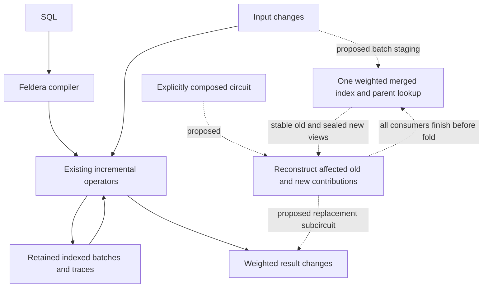

# Can one merged index replace a pipeline's retained intermediate state?

**Conclusion:** weighted bases can reconstruct the examined logical state, but the evidence does not yet
establish a drop-in Feldera trace replacement or an I/O advantage. The recommended first integration is a
query-specific evaluator that reconstructs affected keys before and after each batch and emits their weighted
difference. Compose that circuit explicitly and bypass the replaced stateful subcircuit.

This investigation covers Q3's complete four-column relational result before ordering/limit, plus LeanStore's
Customer–Orders–Lineitem portions of Q5 and Q10. It targets one nonrecursive pipeline, valid keys, non-null
values, exact arithmetic, and complete batches. Multi-pipeline design and compaction-driven maintenance are
outside scope. The baseline is **unmodified Feldera**, including its disk-backed state, rather than an assumed
in-memory implementation.

| Question | Finding | Confidence | Detail |
| --- | --- | --- | --- |
| Can Q3's five logical accumulations be reconstructed? | Yes under the supplied weighted-base and complete-group contract. | Semantically demonstrated; existing model tests pass | [Contracts](reports/paper-contracts.md) |
| Is this already an index swap in Feldera? | No. Feldera already has physical indexes; replacing their retained intermediate data with base reconstruction requires new runtime wiring. | High, source-backed | [Indexes](reports/feldera-indexes.md), [runtime](reports/runtime-reconstruction.md) |
| Does a new/old bit suffice? | Only with stable base tuples, signed pending changes, retained old payloads, and a batch barrier. | Proposed physical protocol | [Storage](reports/merged-index-storage.md) |
| How should the prototype circuit be built? | Compose it explicitly; SQL shape control is an optional later route. | Design decision; compiler audit supports separation | [Compiler](reports/compiler-control.md) |
| Will reconstruction reduce I/O? | Co-location may share reads across integrators, but large descendant scans and maintenance writes can erase the benefit. | Unverified | [Query and I/O analysis](reports/query-reconstruction.md) |

## Recommended route

Start with a hand-composed Q3 circuit and an explicit evaluator boundary. Stage weighted source changes in the
merged index, determine affected orders from both batch states, and reconstruct each old/new contribution with
a shared range traversal. Emit the consolidated difference into the remaining circuit. Compare correctness
with ordinary query evaluation and unmodified Feldera before assessing speed.

The index stores weights directly. A separate phase bit distinguishes stable base entries from pending signed
changes: old reads use the base; new reads consolidate base plus pending. **Deletion retention** keeps old
payloads readable until consumers finish. **Parent rekeying** moves an order and its unchanged lines between
customer prefixes, retaining both paths during the batch.

Feldera implements Z-sets using physical sorted memory/disk batches. Root-circuit join traces retain weighted
indexed collections with a unit timestamp; no historical versions are required for the scoped old/new algebra.
Feeding reconstructed snapshots into unchanged incremental operators would build retained state again. Direct
cursor replacement remains an option to investigate, with seek, ownership, and scheduling contracts to
satisfy.

## Blockers and decision gates

The first gates are correct hand-composed circuit behavior; bounded scans and persistent parent lookup;
old/new visibility across runtime steps; and recoverable atomic finalization. Compiler shape control is not a
prerequisite. Q5 supplies joined COL rows with an external Region/Nation input; Q10 supplies joined
returned-line rows. Their final aggregates remain downstream. SQL constraints and generalized bag stress cases
must remain distinct.

The performance decision requires beyond-memory measurements under equal memory budgets and comparable
durability. Count the union of reads across all consumers, including RF1/RF2 discovery, scan sharing, cache
misses, staging, and fold writes. No performance improvement or storage reduction has been measured here.

[Worked weighted examples](evidence/weighted-examples.md),
[future tests and experiments](evidence/validation-plan.md), and the
[revision/source map](evidence/source-map.md) provide the detailed evidence.
