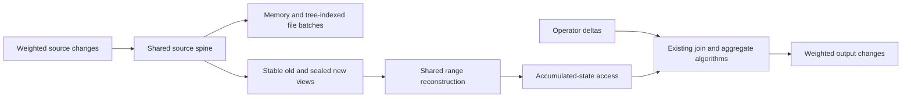
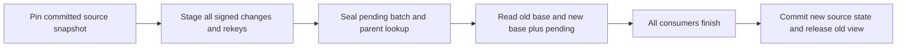

# Reconstructing accumulated state from a merged index

## How Feldera stores indexed state

Feldera already has the storage machinery needed for a disk-backed merged index. Reuse that backend to store
weighted source records together, then reconstruct the accumulated relations requested by incremental
operators. Preserve their join and aggregation algorithms; change where they obtain accumulated state.
This note defines that architecture for one nonrecursive root circuit. Q3 supplies the complete relational
example, before ordering and the ten-row limit. Exact Rust interfaces and implementation are subsequent work.

A Z-set maps complete tuples to signed integer weights. Inserts add weight, deletions subtract it, and equal
tuples consolidate by addition. An indexed Z-set groups values under sorted keys. Neither a Z-set nor its
logical index implies that the data lives entirely in memory.

Feldera retains indexed changes in a **spine of immutable batches**. New batches enter the spine; background
merges combine batches, consolidating weights. This is LSM-style organization across batches. Within a file
batch, tree indexes direct seeks into sorted data blocks. The tree inside an immutable batch and the spine
across batches solve different problems: locating records and maintaining accumulated updates, respectively.
The design does not require a mutable B-tree replacing Feldera's storage system.

| Layer | Existing representation | Role in the proposed design |
| --- | --- | --- |
| Logical collection | Indexed keys, values, signed weights | Preserve tuple multiplicity and cancellation. |
| Memory batch | Sorted key offsets and weighted value leaves | Build and read small batches without file I/O. |
| File batch | Immutable sorted records with tree-indexed blocks | Seek and scan source ranges beyond RAM. |
| Spine | Collection and merging of immutable batches | Accumulate source changes and consolidate reads. |

The fallback indexed batch supports memory and file representations. A cursor combines relevant batches to
read their accumulated contents; a single logical seek need not touch only one file. Root-circuit timestamps
are unit values, so the generic timed-spine name does not imply historical timestamp lists for this scope.
Root file batches also support batched key fetching, an existing capability that must remain in the baseline.
See [Batches combine an LSM spine with tree indexes](support.md#batches-combine-an-lsm-spine-with-tree-indexes)
for the representation and fetch evidence.

## What changes in our design

Store Customer, Orders, and extended Lineitem records in a shared customer-leading order: customer `(c)`,
order `(c,o)`, and line `(c,o,l)`, with record tags and complete payloads. An extended line carries the customer
prefix derived from its order. Weights remain explicit. A persistent native-order lookup resolves an order
identifier to its customer prefix when an update does not supply that prefix.

The central change is **reconstructed accumulated access**. A join still combines a delta with an accumulated
relation and multiplies matching weights. An aggregate still applies its weighted summary and output-update
logic. Their access layer derives the requested logical relation from the merged source ranges instead of
reading a separately retained intermediate trace. Intermediate deltas and transient reconstructed batches
still exist; the goal is to avoid maintaining their accumulated contents as additional durable collections.

One storage owner stages each source batch, publishes consistent views, and keeps them alive for every
consumer. Logical accessors provide the key order, seek behavior, values, and weights expected by their
operators. Customer-leading storage can serve both customer ranges and order ranges through parent lookup;
other required orderings may need bounded sorting or an additional access path. Such costs belong to the
design, rather than being hidden behind a cursor abstraction.

The access change also covers aggregation's retained output. Reconstructing aggregate input alone leaves
state behind in the output-update path. Every replaced state object must therefore be assigned either a
reconstruction provider or an explicit retained role. Feeding entire snapshots into ordinary incremental
inputs would accumulate them again. The architectural boundary is at accumulated-state access, with new
ownership and scheduling wiring required; the current APIs do not already implement this substitution.
[Aggregation also retains output state](support.md#aggregation-also-retains-output-state) identifies the
concrete runtime path and its obligations.

## How Q3 works with reconstructed state

Assume valid primary and foreign keys, non-null query values, fixed predicates, exact arithmetic, and complete
before/after input batches. Under these assumptions Q3 can aggregate qualifying lines per order before
joining Orders and Customer. This is the selected logical shape, not a claim about a captured compiler plan.
The result retains order key, revenue, order date, and ship priority.

Let `s` denote old or new state, `w_s(x)` the consolidated weight of complete tuple `x`, and
`rho(l) = price(l) * (1 - discount(l))`. A qualifying line has ship date after the fixed cutoff; an eligible
order has order date before it; an eligible customer has the requested segment. For order prefix `k`, define
`N_s(k) = sum w_s(l)` and `R_s(k) = sum w_s(l) * rho(l)` over qualifying lines.

| Logical accumulation | Reconstructed value | Source access |
| --- | --- | --- |
| Count/revenue summary `H` | `(N_s(k), R_s(k))` | Complete qualifying line range for order `k`. |
| Aggregate group relation `A` | `(k,R_s(k))` with weight one when `N_s(k)>0` | Derived from `H`; no further source read. |
| Eligible Orders `O` | Complete order tuples passing the date predicate, with source weights | Old/new order payloads. |
| Aggregate–Orders join `B` | `A join O`, multiplying matching weights | Reuse reconstructed `A` and the parent order. |
| Eligible Customers `C` | Customer tuples passing the segment predicate, with source weights | Old/new customer payloads. |

The final relation projects `B join C`. Projection adds weights of identical output tuples. Revenue is a
field of the aggregate tuple, so changing revenue retracts the old tuple and inserts the new tuple; its weight
is not the line count. A nonempty group with zero revenue must remain present. The count supplies group
existence even when its sum is zero. These five logical accumulations are not a count of runtime state objects:
the aggregate's output-update machinery also needs the previous emitted value, which can be derived from old
`A`. [Weighted reconstruction preserves group existence](support.md#weighted-reconstruction-preserves-group-existence)
records the algebra and the limits of the key assumptions.

For one worked update, an eligible customer's eligible order has two qualifying lines with revenues 60 and
40, each of weight one. Replace the second line with a revenue-50 payload: stage the complete old tuple at
weight `-1` and the new tuple at `+1`. In the same batch, change the customer to an ineligible segment,
retracting its old payload and inserting its new one.

| Reconstructed item | Old | New |
| --- | --- | --- |
| Qualifying line summary `H` | Count 2, revenue 100 | Count 2, revenue 110 |
| Group relation `A` | `(k,100)` at weight 1 | `(k,110)` at weight 1 |
| Eligible order `O` | Present | Present |
| Joined relation `B` | Order with revenue 100 | Order with revenue 110 |
| Eligible customer `C` | Present | Absent |
| Q3 output | Order with revenue 100 | Absent |

The correct output delta retracts the revenue-100 result once. Feldera's join orientation can compute
`deltaB join C_new + B_old join deltaC`: the first term is empty and the second retracts the old result.
Using old state on both branches would incorrectly introduce a revenue-110 contribution. Old/new selection
must follow each operator's delta identity, including simultaneous changes.

One traversal of the order range supplies both line summaries, both group tuples, and both joined tuples;
it reuses the decoded parent payloads. A customer change expands the affected set to all descendant orders
visible in either state. Discover affected identities from the support of complete-tuple changes: projecting
signed replacements to keys first can cancel their weights and hide a changed order. Consumers share decoded
records but need independent positions. A slow consumer can pin buffers, so bounded sharing must account for
spilling or rereading oversized ranges.

In the example, old reads retain the revenue-40 line and eligible customer payload even after pending
retractions exist. New reads consolidate base plus pending. Immutable batch snapshots support this separation;
a per-record old/new bit is not required as a backend choice, and cannot replace signed weights or retention.
An order reassignment also stages placement changes for unchanged descendant lines and preserves both parent
paths. Publication and recovery must cover source records and lookup changes together. Ordinary compaction
may run independently; it must not determine logical batch completion.
[Immutable batches preserve old reads](support.md#immutable-batches-preserve-old-reads) explains the lifecycle
requirements and what remains to implement.

Q5 and Q10 add two useful constraints. Q5 needs a consistently versioned external Nation/Region gate and line
supplier identifiers; a per-order revenue total would lose information needed downstream. Q10 needs returned
line rows and customer output payloads, with its final customer aggregate downstream. These boundaries show
why reconstruction must reproduce the consumer's exact relation, not just a convenient summary.
See [Consumers determine the required payload](support.md#consumers-determine-the-required-payload).

## Why this could improve I/O

The expected saving comes from avoiding retained intermediate collections and their writes. Source changes
still enter a spine and incur consolidation and persistence work, but reconstructed `A` and `B` need not have
separate accumulated storage. Co-location also lets several logical consumers use one physical range read.
Neither benefit implies that every update becomes cheaper.

Refresh processing offers another sharing opportunity. RF1 inserts an order and its lines: customer reads
can serve both validation and eligibility, and staged rows can supply new-state reconstruction. RF2 deletes
an order and its lines: native-order lookup and the old range scan can supply deletion payloads and old
operator inputs together. This requires retaining full decoded payloads until consumption; discovery that
collects only identifiers does not achieve that reuse.
[Refresh reads can serve reconstruction](support.md#refresh-reads-can-serve-reconstruction) distinguishes the
existing refresh behavior from the proposed sharing.

Reconstruction trades writes and persistent intermediate bytes for reads, decoding, and computation. A single
line change may rescan all `f` lines of its order; a customer change may visit every descendant. Rekeying
writes placement changes for unchanged lines. Old snapshots, pending batches, shared buffers, lookup storage,
and any additional ordering increase memory or peak storage. Existing Feldera traces may answer selective
probes more cheaply, especially with cached or batched fetches.

Judge the design against unmodified Feldera with identical results, updates, memory budgets, and comparable
durability. Measure actual read/write bytes, repeated reads, seeks, decoded records, CPU, peak memory and
storage, and complete-batch latency. Include refresh discovery, parent lookup, staging, compaction,
checkpointing, and spills. The union of touched blocks describes potential reuse; device read events measure
realized traffic. Test beyond-memory state with both localized refresh groups and scattered updates, including
large descendant ranges.

Weighted reconstruction has semantic model evidence; storage integration, recovery, and the I/O improvement
remain unmeasured. First verify reconstructed inputs and output deltas against independent evaluation, then
verify snapshot and scheduling behavior, and finally measure total maintenance cost.
[Evidence and measurements bound the claim](support.md#evidence-and-measurements-bound-the-claim) gives the
existing checks and the compact acceptance criteria.
