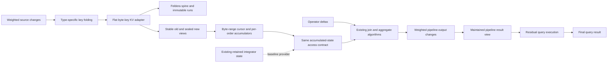
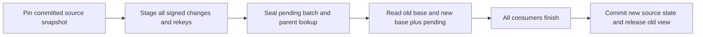

# Reconstructing accumulated state from a merged index

## References and how each helps

This guide lists all sources used by this note and its supporting report, grouped by source file. Detailed
line-level citations remain beside the claims they support. Start with the interesting-orderings manuscript
for general merged-index design, LeanStore for working storage and query execution, and the lecture note
for Q3 maintenance semantics. The validated `mi_db` scan-session section supplies the sharing design;
validation does not extend to its other sections.
Local links assume the sibling checkout layout; public code links pin the inspected revisions. The modified
`mi_db` design is identified by revision and content hash in the supporting report.

### Design documents

| Reference | How it helps |
| --- | --- |
| [Interesting-orderings manuscript — general design](../../../../merged_index_interesting_orderings/main.tex#L515) | Primary design reference for order-sharing pipelines, heterogeneous folded keys, backend reuse, and the distinction between pipeline output and remaining query work. |
| [Multi-pipeline query execution manuscript](../../../../query_execution_using_MI/main.tex#L88) | Future direction: composing pipelines through intermediate views. Outside this project’s scope; single-pipeline maintenance provides groundwork. |
| [Maintaining a Query, One Change at a Time](../../../../DBSP_w_merged_index/dbsp-merged-index-feasibility.tex#L276) | Defines the selected Q3 circuit, its five accumulated states, old/new algebra, reconstruction formulas, key assumptions, and affected-key discovery. Figure 4, “Equivalent Q3 circuits,” panel (c), is the circuit referenced here. |
| [Equivalent Q3 circuits — figure source](../../../../DBSP_w_merged_index/figures/q3-dbsp-circuit.tex#L59) | Shows the exact grouping, delay, and join wiring, so the location of each integrator can be checked. |
| [Operator-state guide](../../../../DBSP_w_merged_index/operator-state.tex#L39) | Explains support and group existence: a nonempty zero-revenue group differs from an empty group. |
| [mi_db validated scan-session design](../../../../mi_db/docs/architecture.md#merged-index-scan-sessions) | The scan-session section is validated. Other sections, including the separate buffer guard, require independent assessment. Spill/reread and Feldera batch-lifetime pseudocode are extensions proposed here. |
| [Interesting-orderings manuscript — experiments](../../../../merged_index_interesting_orderings/sections/experiments_revised.tex#L173) | Defines the refresh workload and reports backend-dependent results, including the LSM comparison. It motivates measuring total maintenance cost rather than assuming a Feldera speedup. |

### Existing Feldera storage and operator behavior

| Reference | How it helps |
| --- | --- |
| [Read/write interfaces — trace.rs](https://github.com/feldera/feldera/blob/f3c06614f53b1c01e0f6b8745d690ad6a2bcac7c/crates/dbsp/src/trace.rs#L231-L308) | Defines weighted collections, the read interface, and insertion of immutable update batches; anchors the interface pseudocode. |
| [Key/value navigation — trace/cursor.rs](https://github.com/feldera/feldera/blob/f3c06614f53b1c01e0f6b8745d690ad6a2bcac7c/crates/dbsp/src/trace/cursor.rs#L42-L109) | Defines key-then-value iteration, forward seeks, borrowed values, and time/weight access. |
| [LSM run management — trace/spine_async.rs](https://github.com/feldera/feldera/blob/f3c06614f53b1c01e0f6b8745d690ad6a2bcac7c/crates/dbsp/src/trace/spine_async.rs#L1-L7) | Shows the generic collection of immutable runs and background merging targeted for reuse. |
| [Read snapshots — trace/spine_async/snapshot.rs](https://github.com/feldera/feldera/blob/f3c06614f53b1c01e0f6b8745d690ad6a2bcac7c/crates/dbsp/src/trace/spine_async/snapshot.rs#L23-L43) | Defines snapshot acquisition, batch ownership/composition, and the combined cursor used for a stable read view. |
| [Weight consolidation — trace/cursor/cursor_list.rs](https://github.com/feldera/feldera/blob/f3c06614f53b1c01e0f6b8745d690ad6a2bcac7c/crates/dbsp/src/trace/cursor/cursor_list.rs#L150-L174) | Shows addition of weights across runs and suppression of zero totals in unit-time reads. |
| [File format — storage/file.rs](https://github.com/feldera/feldera/blob/f3c06614f53b1c01e0f6b8745d690ad6a2bcac7c/crates/dbsp/src/storage/file.rs#L3-L65) | Describes immutable nested groups, per-level tree indexes, auxiliary payloads, and typed comparisons; constrains the flat byte-key adapter. |
| [Memory batches — trace/ord/vec/indexed_wset_batch.rs](https://github.com/feldera/feldera/blob/f3c06614f53b1c01e0f6b8745d690ad6a2bcac7c/crates/dbsp/src/trace/ord/vec/indexed_wset_batch.rs#L158-L199) | Shows sorted keys, value offsets, values, and weights underlying the worked layout example. |
| [Memory/file selection — trace/ord/fallback/indexed_wset.rs](https://github.com/feldera/feldera/blob/f3c06614f53b1c01e0f6b8745d690ad6a2bcac7c/crates/dbsp/src/trace/ord/fallback/indexed_wset.rs#L34-L58) | Confirms that retained indexed state can use either memory or file-backed batches. |
| [File batches — trace/ord/file/indexed_wset_batch.rs](https://github.com/feldera/feldera/blob/f3c06614f53b1c01e0f6b8745d690ad6a2bcac7c/crates/dbsp/src/trace/ord/file/indexed_wset_batch.rs#L447-L478) | Shows batched key fetching and, later in the file, key/value batch construction. Both matter when defining the baseline and adapter boundary. |
| [Timestamp specialization — time.rs](https://github.com/feldera/feldera/blob/f3c06614f53b1c01e0f6b8745d690ad6a2bcac7c/crates/dbsp/src/time.rs#L214-L219) | Shows that root-circuit unit time selects ordinary batches; distinguishes runtime timestamps from merged-index source versions. |
| [Incremental joins — operator/dynamic/join.rs](https://github.com/feldera/feldera/blob/f3c06614f53b1c01e0f6b8745d690ad6a2bcac7c/crates/dbsp/src/operator/dynamic/join.rs#L698-L749) | Establishes delta/current-state and delta/delayed-state wiring, plus the baseline batched-fetch path. |
| [Aggregation — operator/dynamic/aggregate.rs](https://github.com/feldera/feldera/blob/f3c06614f53b1c01e0f6b8745d690ad6a2bcac7c/crates/dbsp/src/operator/dynamic/aggregate.rs#L766-L796) | Explains generic aggregation’s retained-input and previous-output strategy, and explicitly discusses recomputing old values as an alternative. |
| [Output replacement — operator/dynamic/upsert.rs](https://github.com/feldera/feldera/blob/f3c06614f53b1c01e0f6b8745d690ad6a2bcac7c/crates/dbsp/src/operator/dynamic/upsert.rs#L90-L109) | Draws the retained-output feedback used to turn replacement values into old-tuple retractions and new-tuple insertions. |
| [Transaction scheduling — circuit/schedule.rs](https://github.com/feldera/feldera/blob/f3c06614f53b1c01e0f6b8745d690ad6a2bcac7c/crates/dbsp/src/circuit/schedule.rs#L186-L226) | Shows why a transaction may span multiple runtime steps and why one exhausted cursor is not a completion barrier. |
| [Commit handling — circuit/circuit_builder.rs](https://github.com/feldera/feldera/blob/f3c06614f53b1c01e0f6b8745d690ad6a2bcac7c/crates/dbsp/src/circuit/circuit_builder.rs#L7777-L7805) | Provides the commit-flushing behavior that must be considered when retiring old views and publishing batch progress. |

### RocksDB comparison and LeanStore implementation evidence

| Reference | How it helps |
| --- | --- |
| [RocksDB overview](https://github.com/facebook/rocksdb/wiki/RocksDB-Overview) | Supplies the familiar memtable/SST and key-value baseline for the storage comparison. |
| [RocksDB merge operator](https://github.com/facebook/rocksdb/wiki/Merge-Operator) | Explains application-defined update combination; prevents treating weighted addition as a capability RocksDB lacks. |
| [LeanStore B-tree merged-index adapter](https://github.com/alicia-lyu/leanstore/blob/305ad0a98b147d048a37a1eba3787b35b1181b85/frontend/shared/adapter-scanner/LeanStoreMergedAdapter.hpp#L25) | Working B-tree storage with record-specific folded byte keys and payloads. |
| [LeanStore RocksDB merged-index adapter](https://github.com/alicia-lyu/leanstore/blob/305ad0a98b147d048a37a1eba3787b35b1181b85/frontend/shared/adapter-scanner/RocksDBMergedAdapter.hpp#L22) | Working LSM storage for the same merged-index design. |
| [LeanStore Q3 execution](https://github.com/alicia-lyu/leanstore/blob/305ad0a98b147d048a37a1eba3787b35b1181b85/frontend/tpch/q3/query.tpp#L446) | Executes the Customer–Orders–Lineitem scan, per-order aggregation, and final top-10 selection; does not establish the proposed incremental maintenance. |
| [LeanStore Q5 implementation](https://github.com/alicia-lyu/leanstore/blob/305ad0a98b147d048a37a1eba3787b35b1181b85/frontend/tpch/q5/query.tpp#L219-L335) | Shows the external Nation/Region eligibility check, supplier-field use, and actual date bounds that a Q5 comparison must preserve. |
| [LeanStore Q10 logical plan](https://github.com/alicia-lyu/leanstore/blob/305ad0a98b147d048a37a1eba3787b35b1181b85/frontend/tpch/q10/plans/family_logical.dot#L34-L69) | Establishes the selected join boundary and downstream aggregation, without assuming a stored per-order summary. |
| [LeanStore Q10 visitor](https://github.com/alicia-lyu/leanstore/blob/305ad0a98b147d048a37a1eba3787b35b1181b85/frontend/tpch/q10_family/visitor.hpp#L126-L200) | Shows the customer and returned-line payloads needed by downstream consumers. |
| [LeanStore Q10 date bounds](https://github.com/alicia-lyu/leanstore/blob/305ad0a98b147d048a37a1eba3787b35b1181b85/frontend/tpch/q10/query.tpp#L100-L107) | Supplies the concrete day-offset predicate, which must be matched rather than assumed equivalent to a calendar interval. |
| [LeanStore refresh discovery](https://github.com/alicia-lyu/leanstore/blob/305ad0a98b147d048a37a1eba3787b35b1181b85/frontend/tpch/tpch_family/refresh.hpp#L143-L178) | Shows RF2 parent lookup and line-number discovery; clarifies what additional payload retention is needed to share these reads. |
| [LeanStore merged-index maintenance](https://github.com/alicia-lyu/leanstore/blob/305ad0a98b147d048a37a1eba3787b35b1181b85/frontend/tpch/tpch_family/col_pipeline.tpp#L150-L220) | Shows insertion and erasure paths whose read/write work must be included in maintenance accounting. |

### Detailed explanations in this repository

| Reference | How it helps |
| --- | --- |
| [Storage differences from RocksDB](support.md#storage-differences-from-rocksdb) | Connects the baseline comparison to concrete storage sources. |
| [Trace access traverses keys then weighted values](support.md#trace-access-traverses-keys-then-weighted-values) | Provides interface pseudocode, an array layout, traversal/lookup examples, and interchangeable read providers. |
| [Folded keys require flat KV storage](support.md#folded-keys-require-flat-kv-storage) | Defines the record representation and weighted-update requirements for reusing the LSM machinery. |
| [Shared scan sessions bound ownership and memory](support.md#shared-scan-sessions-bound-ownership-and-memory) | Specifies owner/view lifetime, ordering, reader positions, borrowed records, and bounded overflow behavior in pseudocode. |
| [Merged index reconstructs integrator outputs](support.md#merged-index-reconstructs-integrator-outputs) | Maps the selected circuit to reconstruction routines and diagrams equivalent placements of delayed aggregate state. |
| [Weighted reconstruction preserves group existence](support.md#weighted-reconstruction-preserves-group-existence) | Gives the formulas and explains why count and revenue serve different purposes. |
| [Immutable batches preserve old reads](support.md#immutable-batches-preserve-old-reads) | Separates existing snapshot primitives from the publication/recovery behavior the adapter must implement. |
| [Consumers determine the required payload](support.md#consumers-determine-the-required-payload) | Summarizes Q5/Q10 requirements that prevent replacing every requested relation with a revenue total. |
| [Refresh reads can serve reconstruction](support.md#refresh-reads-can-serve-reconstruction) | Identifies shareable RF1/RF2 work and the limits of existing refresh evidence. |
| [Evidence and measurements bound the claim](support.md#evidence-and-measurements-bound-the-claim) | Records source provenance, acceptance criteria, and the measurements still needed. |

## How Feldera stores indexed state

> [!NOTE]
> **Glossary**
>
> **Retained state** — An integrator's accumulated output stored and maintained across input updates.
> Reads obtain its tuples from that maintained collection, which may reside in memory or files.
>
> **Reconstructed state** — The same integrator output computed for requested keys and an old/new version
> from stored, timed weighted source records, instead of maintaining that output as a separate collection.
>
> Both supply the same tuples, weights, group presence/absence, and cursor ordering to the existing IVM
> path. Neither term refers to reconstructing input deltas. Reconstructed state still depends on retained
> source data and may use bounded temporary buffers; the distinction is how the integrator output is supplied.
>
> **root circuit** — top-level operator graph.
>
> **Order-sharing pipeline** — Consecutive query operators that use compatible tuple orderings.
>
> **Residual execution** — Query work performed over the maintained pipeline result to produce the final result.

Reuse Feldera's LSM machinery with a flat byte-key/value representation for the merged index. Reconstruct
accumulated relations from that store while preserving join and aggregation algorithms. The adapter changes
record representation and accumulated-state access; it does not require a separate LSM implementation.
The target is maintenance of the result of one **order-sharing pipeline** in a nonrecursive **root circuit**.
Its maintained view may still need **residual execution**, such as Q3's final ordering/limit and projection.
The [interesting-orderings design](../../../../merged_index_interesting_orderings/main.tex#L751)
explicitly allows a pipeline to be only part of a query. Internal integrator reconstruction does not remove
the maintained pipeline result. Rust interfaces and implementation are subsequent work.
Composing multiple pipelines is outside scope; this project provides groundwork for the
[multi-pipeline query execution design](../../../../query_execution_using_MI/main.tex#L88).

Compared with RocksDB, the relevant differences are the update semantics and the representation supplied to
storage:

> [!NOTE]
> **Glossary**
>
> **Z-set** — relation with signed tuple multiplicities.
>
> **batch** — immutable sorted run of weighted updates, in memory or a file.
>
> **spine** — Feldera's LSM run collection and background merger.

| Aspect | RocksDB | Feldera |
| --- | --- | --- |
| Update semantics | `Put` replaces a key's value; `Delete` removes it. An application-defined `Merge` operator can combine updates. | A **Z-set** adds weights for identical complete tuples and drops zero totals. An indexed Z-set groups weighted values by key. |
| Unit supplied to accumulated storage | Ordinary writes enter a mutable memtable before becoming immutable sorted runs. | A **batch** enters a **spine**. A storage batch is distinct from an input update batch. |
| Indexed record layout | A sorted key-to-value mapping. | `K → {V → weight}`: each search key has a sorted group of weighted values; equivalently, `(K,V) → weight`. |

> [!NOTE]
> **Glossary**
>
> **columns** — storage nesting levels, not SQL attributes.
>
> **Trace** — Feldera's interface for reading and updating retained state.

For a join keyed by customer ID, `K` is that ID and each `V` can be a complete order tuple. Each file-backed
batch indexes keys and nested value groups. The format calls these levels **columns**. The outer level is ordered by
`K`; within each fixed `K`, values are ordered
by `V`. Inner seeks compare `V`, and consolidation combines weights for identical `(K,V)` tuples across runs.
This describes existing operator state.
Feldera exposes retained state through the **trace** interface. `Spine` implements this interface
by holding immutable sorted runs and merging them in the background. See [Storage differences from
RocksDB](support.md#storage-differences-from-rocksdb).
[Trace access traverses keys then weighted values](support.md#trace-access-traverses-keys-then-weighted-values)
shows interface pseudocode, array layout, cursor traversal, and the flat merged-index adapter.

In this root circuit, logical time has a single value, written `()` in Rust, so records need no varying
logical timestamp. Feldera's file batches also support fetching multiple requested keys together; retain
that optimization in the baseline comparison.

## What changes in our design

> [!NOTE]
> **Glossary**
>
> **Folding** — Encoding key fields into a byte string using a record-type-specific rule.

Following the [primary folded-key design](../../../../merged_index_interesting_orderings/main.tex#L545),
the merged index uses standard KV storage: `fold_type(record) → encoded_value`. **Folding** produces the byte key.
Customer, Orders, and extended Lineitem
have different rules; their logical customer-leading positions are `(c)`, `(c,o)`, and `(c,o,l)`. The storage
layer compares opaque byte strings lexicographically. It does not expose those fields as nested groups.
The encoding must preserve the intended cross-type ordering and let the access layer construct range bounds.

Values retain payloads, weights, and record types. A range cursor reads KV entries in byte-key order and
decodes the fields needed by the requesting operator. For Q3, it scans one order's lines while updating old/new
count and revenue accumulators, then returns the requested state tuples. It does not build an in-memory
relation containing all those lines.
A persistent native-order lookup resolves an order to its customer-leading position. Reuse the spine, run
management, compaction, cache, and snapshots; adapt the record format, byte comparison, and weighted-value
merge rules. Flat KV records do not require a different LSM, but the grouped indexed batch cannot be reused
unchanged.
Payload replacement must preserve old/new values and signed changes; ordinary last-write-wins handling alone
cannot implement weighted reconstruction. [Folded keys require flat KV
storage](support.md#folded-keys-require-flat-kv-storage)
defines this boundary and the remaining adapter work.

> [!NOTE]
> **Glossary**
>
> **integrator state** — retained results of accumulating changes.

The integration boundary is **accumulated-state access**: for requested keys and an old/new view, return the
same tuples, weights, ordering, and absence information that existing **integrator state** would supply. The provider
scans encoded ranges to derive those tuples. Operator
code consumes them through the same access contract, whether they were retained or reconstructed.

The existing incremental view maintenance (IVM) algorithm determines the output: an additive summary can
emit a tuple carrying a value difference; a replacement emits `-[[old_tuple]] + [[new_tuple]]`, where `[[t]]`
denotes one copy of tuple `t`. The merged index can supply state for either algorithm. Choosing the delta
form and computing it remain in the shared operator path. Returned tuples are streamed or buffered within
a byte limit, without storing another complete accumulated relation.

> [!NOTE]
> **Glossary**
>
> **Sealing** — Making the complete pending update set immutable and available to readers.

One storage owner stages each input update batch, publishes consistent views, and keeps them alive for every
consumer. Provider cursors seek encoded ranges and return the requested state through the shared contract. When
byte-key order differs from the required operator order, use budgeted external sorting or a maintained access
path and count its I/O. Each shared scan has a byte-limited buffer and per-consumer positions; a lagging
consumer must cause backpressure, spilling, or rereading, rather than unbounded retention.
[Shared scan sessions bound ownership and memory](support.md#shared-scan-sessions-bound-ownership-and-memory)
gives pseudocode for batch lifetime, provider requests, reader positions, ordering, and overflow handling.
Its scan-sharing basis is the validated `mi_db` scan-session section; the Feldera lifecycle and overflow
extensions remain proposals.

The reconstruction target is each integrator's accumulated output state, not its input delta stream.
In [Maintaining a Query, One Change at a Time](../../../../DBSP_w_merged_index/dbsp-merged-index-feasibility.tex#L276),
panel (c) of “Equivalent Q3 circuits” (Figure 4) has one Count/Revenue integrator inside grouping and a delay
supplying its old summary.
The existing emit functions compute old/new aggregate tuples from those summaries. Timed weighted source
records supply each requested version: retaining an old emitted tuple and computing it from the old summary
serve the same old-state read. The integrator for `A`
belongs to the following Orders join, not to grouping. Separate routines reconstruct `H`, `A`, and the other
requested states without changing delta processing or adding another grouping integrator.
[Merged index reconstructs integrator outputs](support.md#merged-index-reconstructs-integrator-outputs)
diagrams that panel and explains the equivalent placement of old-state retention in Feldera's generic aggregate.

## How Q3 works with reconstructed state

Assume valid primary and foreign keys, non-null query values, fixed predicates, exact arithmetic, and complete
before/after input batches. Under these assumptions Q3 can aggregate qualifying lines per order before
joining Orders and Customer. This is the selected logical shape, not a claim about a captured compiler plan.
The result retains order key, revenue, order date, and ship priority.

Let `s` denote old or new state, `w_s(x)` the consolidated weight of complete tuple `x`, and
`rho(l) = price(l) * (1 - discount(l))`. A qualifying line has ship date after the fixed cutoff; an eligible
order has order date before it; an eligible customer has the requested segment. For order prefix `k`, define
`N_s(k) = sum w_s(l)` and `R_s(k) = sum w_s(l) * rho(l)` over qualifying lines.
`R` is the revenue value; `N` is the count, including multiplicity, used to decide whether to emit a group.
One qualifying zero-revenue line gives `(N,R)=(1,0)` and emits `(k,0)`; no qualifying lines gives `(0,0)`
and emits nothing. Revenue alone cannot distinguish these states. Deleting that last zero-revenue line
therefore retracts `(k,0)` even though revenue does not change.

| Logical accumulation | Reconstructed value | Source access |
| --- | --- | --- |
| Count/revenue summary `H` | `(N_s(k), R_s(k))` | Complete qualifying line range for order `k`. |
| Aggregate group relation `A` | `(k,R_s(k))` with weight one when `N_s(k)>0` | Derived from `H`; no further source read. |
| Eligible Orders `O` | Complete order tuples passing the date predicate, with source weights | Old/new order payloads. |
| Aggregate–Orders join `B` | `A join O`, multiplying matching weights | Reuse reconstructed `A` and the parent order. |
| Eligible Customers `C` | Customer tuples passing the segment predicate, with source weights | Old/new customer payloads. |

The final relation projects `B join C`. Projection adds weights of identical output tuples. Revenue is a
field of the aggregate tuple, so changing revenue retracts the old tuple and inserts the new tuple; its weight
is not the line count. The lecture note's panel (c) computes the old aggregate tuple from the delayed summary
`H_old`; it does not require another integrator to retain that tuple. The lecture note calls this summary `M`.
[Weighted reconstruction preserves group existence](support.md#weighted-reconstruction-preserves-group-existence)
records the algebra and the limits of the key assumptions.

For one worked update, an eligible customer's eligible order has two qualifying lines with revenues 60 and
40, each of weight one. Replace the second line with a revenue-50 payload: stage the complete old tuple at
weight `-1` and the new tuple at `+1`. In the same batch, change the customer to an ineligible segment,
retracting its old payload and inserting its new one.

| Reconstructed item | Old | New |
| --- | --- | --- |
| Qualifying line summary `H` | Count 2, revenue 100 | Count 2, revenue 110 |
| Group relation `A` | `(k,100)` at weight 1 | `(k,110)` at weight 1 |
| Eligible order `O` | Present | Present |
| Joined relation `B` | Order with revenue 100 | Order with revenue 110 |
| Eligible customer `C` | Present | Absent |
| Q3 output | Order with revenue 100 | Absent |

The correct output delta retracts the revenue-100 result once. Feldera's join orientation can compute
`deltaB join C_new + B_old join deltaC`: the first term is empty and the second retracts the old result.
Using old state on both branches would incorrectly introduce a revenue-110 contribution. Old/new selection
must follow each operator's delta identity, including simultaneous changes.

> [!NOTE]
> **Glossary**
>
> **support** — tuples with nonzero weight.

One traversal of the order range supplies both line summaries, both group tuples, and both joined tuples;
it reuses the decoded parent payloads. A customer change expands the affected set to all descendant orders
visible in either state. Discover affected identities from the **support** of
complete-tuple changes: projecting
signed replacements to keys first can cancel their weights and hide a changed order. Consumers share decoded
records but need independent positions. A slow consumer can pin buffers, so bounded sharing must account for
spilling or rereading oversized ranges.

> [!NOTE]
> **Glossary**
>
> **Rekeying** — Moving records to a changed physical key prefix.

In the example, old reads retain the revenue-40 line and eligible customer payload even after pending
retractions exist. New reads apply the pending weighted changes to the base. The flat KV adapter must preserve this
separation;
a per-record old/new bit is not required as a backend choice, and cannot replace signed weights or retention.
An order reassignment also stages placement changes for unchanged descendant lines and preserves both parent
paths. Publication and recovery must cover source records and lookup changes together. Ordinary compaction
may run independently; it must not determine logical batch completion.
[Immutable batches preserve old reads](support.md#immutable-batches-preserve-old-reads) explains the lifecycle
requirements and what remains to implement.

Q5 and Q10 add two useful constraints. Q5 needs a consistently versioned external Nation/Region eligibility filter and
line
supplier identifiers; a per-order revenue total would lose information needed downstream. Q10 needs returned
line rows and customer output payloads, with its final customer aggregate downstream. Reconstruction must preserve the
consumer's exact relation.
See [Consumers determine the required payload](support.md#consumers-determine-the-required-payload).

## Why this could improve I/O

The expected saving comes from avoiding retained intermediate collections and their writes. Source changes
still incur KV update, consolidation, and persistence work, but reconstructed `A` and `B` need not have
separate accumulated storage. Co-location also lets several logical consumers use one physical range read.
Neither benefit implies that every update becomes cheaper.

Refresh processing offers another sharing opportunity. RF1 inserts an order and its lines: customer reads
can serve both validation and eligibility, and staged rows can supply new-state reconstruction. RF2 deletes
an order and its lines: native-order lookup and the old range scan can supply deletion payloads and old
operator inputs together. This requires retaining full decoded payloads until consumption; discovery that
collects only identifiers does not achieve that reuse.
[Refresh reads can serve reconstruction](support.md#refresh-reads-can-serve-reconstruction) distinguishes the
existing refresh behavior from the proposed sharing.

Reconstruction trades writes and persistent intermediate bytes for reads, decoding, and computation. A single
line change may rescan all `f` lines of its order; a customer change may visit every descendant. Rekeying
writes placement changes for unchanged lines. Old snapshots, pending batches, shared buffers, lookup storage,
and any additional ordering increase memory or peak storage. Existing Feldera traces may answer selective
probes more cheaply, especially with cached or batched fetches.

Judge the design against unmodified Feldera with identical results, updates, memory budgets, and comparable
durability. Measure actual read/write bytes, repeated reads, seeks, decoded records, CPU, peak memory and
storage, and complete-batch latency. Include refresh discovery, parent lookup, staging, compaction,
checkpointing, spills, and writes to the maintained pipeline result. Hold residual query execution constant
and report its cost separately from maintenance. The union of touched blocks describes potential reuse;
device read events measure realized traffic. Test beyond-memory state with both localized refresh groups
and scattered updates, including
large descendant ranges.

The design sources specify weighted reconstruction semantics; implementation correctness, recovery, and
the I/O improvement remain to be established. First verify reconstructed integrator outputs and IVM deltas
against independent evaluation, then verify snapshot and scheduling behavior, and finally measure total maintenance cost.
[Evidence and measurements bound the claim](support.md#evidence-and-measurements-bound-the-claim) gives the
source provenance and implementation acceptance criteria.

## Next Steps

1. **Bind the Q3 state requests.** Map the selected circuit's `H`, `A`, `O`, `B`, and `C` accesses to concrete
   runtime read sites, including old/new views and cursor operations. Specify the Rust adapter interfaces
   from the [trace-access pseudocode](support.md#trace-access-traverses-keys-then-weighted-values). Keep delta
   streams and IVM computation shared between retained and reconstructed state providers.
2. **Implement flat KV storage on the existing LSM.** Define each record type's folded key, range bounds,
   payload/weight encoding, and source-batch version handling. Implement the batch and merge contracts needed
   by the spine, plus persistent parent lookup. Use the primary manuscript and working LeanStore adapters
   as encoding and access-path references. Verify byte order, payload replacements, signed updates,
   descendant rekeys, and old-view retention before integrating operators.
3. **Implement reconstruction and bounded scan sharing.** Supply per-integrator routines, then connect them
   through the [session protocol](support.md#shared-scan-sessions-bound-ownership-and-memory). Choose explicit
   buffer limits, overflow handling, and ordering paths. Verify consumer progress, borrowed-value lifetimes,
   batch publication, and commit/recovery behavior with ranges larger than the memory budget.
4. **Verify the complete Q3 path.** Run identical updates through retained and reconstructed providers.
   Compare each requested state and maintained pipeline view against independent evaluation. Include empty and
   zero-revenue groups, simultaneous source changes, replacements, and rekeys. Confirm that replaced
   integrator state is not still being accumulated elsewhere. Verify residual execution over the view
   separately; keep ordering/limit outside the maintenance boundary.
5. **Measure total maintenance cost.** Benchmark against unmodified Feldera beyond RAM with equal total
   memory and comparable durability. Include RF1/RF2, scattered line updates, customer fan-out, and rekeys.
   Account for all reads, writes, sorting, spill, repeated scans, and background work using the
   [measurement criteria](support.md#evidence-and-measurements-bound-the-claim). Report correctness and
   performance separately; extend to the stated Q5/Q10 boundaries after the Q3 path is validated.
