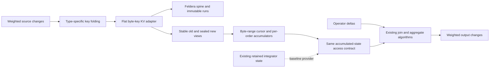
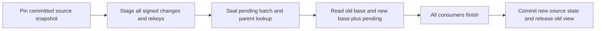

# Reconstructing accumulated state from a merged index

## How Feldera stores indexed state

Reuse Feldera's LSM machinery with a flat byte-key/value representation for the merged index. Reconstruct
accumulated relations from that store while preserving join and aggregation algorithms. The adapter changes
record representation and accumulated-state access; it does not require a separate LSM implementation.
This note covers one nonrecursive **root circuit** (top-level operator graph) and Q3 before ordering/limit.
Rust interfaces and implementation are subsequent work.

Compared with RocksDB, the relevant differences are the update semantics and the representation supplied to
storage:

| Aspect | RocksDB | Feldera |
| --- | --- | --- |
| Update semantics | `Put` replaces a key's value; `Delete` removes it. An application-defined `Merge` operator can combine updates. | A **Z-set** (relation with signed tuple multiplicities) adds weights for identical complete tuples and drops zero totals. An indexed Z-set groups weighted values by key. |
| Unit supplied to accumulated storage | Ordinary writes enter a mutable memtable before becoming immutable sorted runs. | A **batch** (immutable sorted run of weighted updates, in memory or a file) enters a **spine** (Feldera's LSM run collection and background merger). A storage batch is distinct from an input update batch. |
| Indexed record layout | A sorted key-to-value mapping. | `K → {V → weight}`: each search key has a sorted group of weighted values; equivalently, `(K,V) → weight`. |

For a join keyed by customer ID, `K` is that ID and each `V` can be a complete order tuple. Each file-backed
batch indexes keys and nested value groups. The format calls these levels **columns** (storage nesting
levels, not SQL attributes). The outer level is ordered by `K`; within each fixed `K`, values are ordered
by `V`. Inner seeks compare `V`, and consolidation combines weights for identical `(K,V)` tuples across runs.
This describes existing operator state.
A **trace** is Feldera's interface for reading and updating retained state. `Spine` implements this interface
by holding immutable sorted runs and merging them in the background. See [Storage differences from
RocksDB](support.md#storage-differences-from-rocksdb).

In this root circuit, logical time has a single value, written `()` in Rust, so records need no varying
logical timestamp. Feldera's file batches also support fetching multiple requested keys together; retain
that optimization in the baseline comparison.

## What changes in our design

The merged index uses standard KV storage: `fold_type(record) → encoded_value`. **Folding** means encoding
key fields into a byte string using a record-type-specific rule. Customer, Orders, and extended Lineitem
have different rules; their logical customer-leading positions are `(c)`, `(c,o)`, and `(c,o,l)`. The storage
layer compares opaque byte strings lexicographically. It does not expose those fields as nested groups.
The encoding must preserve the intended cross-type ordering and let the access layer construct range bounds.

Values retain payloads, weights, and record types. A range cursor reads KV entries in byte-key order and
decodes the fields needed by the requesting operator. For Q3, it scans one order's lines while updating old/new
count and revenue accumulators, then returns the requested state tuples. It does not build an in-memory
relation containing all those lines.
A persistent native-order lookup resolves an order to its customer-leading position. Reuse the spine, run
management, compaction, cache, and snapshots; adapt the record format, byte comparison, and weighted-value
merge rules. Flat KV records do not require a different LSM, but the grouped indexed batch cannot be reused
unchanged.
Payload replacement must preserve old/new values and signed changes; ordinary last-write-wins handling alone
cannot implement weighted reconstruction. [Folded keys require flat KV
storage](support.md#folded-keys-require-flat-kv-storage)
defines this boundary and the remaining adapter work.

The integration boundary is **accumulated-state access**: for requested keys and an old/new view, return the
same tuples, weights, ordering, and absence information that existing **integrator state** (retained results
of accumulating changes) would supply. The provider scans encoded ranges to derive those tuples. Operator
code consumes them through the same access contract, whether they were retained or reconstructed.

The existing incremental view maintenance (IVM) algorithm determines the output: an additive summary can
emit a tuple carrying a value difference; a replacement emits `-[[old_tuple]] + [[new_tuple]]`, where `[[t]]`
denotes one copy of tuple `t`. The merged index can supply state for either algorithm. Choosing the delta
form and computing it remain in the shared operator path. Returned tuples are streamed or buffered within
a byte limit, without storing another complete accumulated relation.

One storage owner stages each input update batch, publishes consistent views, and keeps them alive for every
consumer. Provider cursors seek encoded ranges and return the requested state through the shared contract. When
byte-key order differs from the required operator order, use budgeted external sorting or a maintained access
path and count its I/O. Each shared scan has a byte-limited buffer and per-consumer positions; a lagging
consumer must cause backpressure, spilling, or rereading, rather than unbounded retention.
[Shared scan sessions bound ownership and memory](support.md#shared-scan-sessions-bound-ownership-and-memory)
gives pseudocode for batch lifetime, provider requests, reader positions, ordering, and overflow handling.

The reconstruction target is each integrator's accumulated output state, not its input delta stream.
Separate routines can derive Q3's Count/Revenue state, aggregate relation `A`, or joined relation `B` for
requested keys and views. The existing IVM algorithm consumes these states alongside its unchanged delta
stream. Feldera's generic aggregate illustrates two accumulated states: the integrated relation it reads
and the previous aggregate output used for retractions. Both are integrator outputs, even though the first
is an input to a downstream computation. Reconstruction routines can share source scans without constructing
a chain of intermediate relations.
[Merged index reconstructs integrator outputs](support.md#merged-index-reconstructs-integrator-outputs)
explains the distinction and gives per-integrator reconstruction pseudocode.

## How Q3 works with reconstructed state

Assume valid primary and foreign keys, non-null query values, fixed predicates, exact arithmetic, and complete
before/after input batches. Under these assumptions Q3 can aggregate qualifying lines per order before
joining Orders and Customer. This is the selected logical shape, not a claim about a captured compiler plan.
The result retains order key, revenue, order date, and ship priority.

Let `s` denote old or new state, `w_s(x)` the consolidated weight of complete tuple `x`, and
`rho(l) = price(l) * (1 - discount(l))`. A qualifying line has ship date after the fixed cutoff; an eligible
order has order date before it; an eligible customer has the requested segment. For order prefix `k`, define
`N_s(k) = sum w_s(l)` and `R_s(k) = sum w_s(l) * rho(l)` over qualifying lines.

| Logical accumulation | Reconstructed value | Source access |
| --- | --- | --- |
| Count/revenue summary `H` | `(N_s(k), R_s(k))` | Complete qualifying line range for order `k`. |
| Aggregate group relation `A` | `(k,R_s(k))` with weight one when `N_s(k)>0` | Derived from `H`; no further source read. |
| Eligible Orders `O` | Complete order tuples passing the date predicate, with source weights | Old/new order payloads. |
| Aggregate–Orders join `B` | `A join O`, multiplying matching weights | Reuse reconstructed `A` and the parent order. |
| Eligible Customers `C` | Customer tuples passing the segment predicate, with source weights | Old/new customer payloads. |

The final relation projects `B join C`. Projection adds weights of identical output tuples. Revenue is a
field of the aggregate tuple, so changing revenue retracts the old tuple and inserts the new tuple; its weight
is not the line count. A nonempty group with zero revenue must remain present. The count supplies group
existence even when its sum is zero. These five logical accumulations are not a count of runtime state objects:
the aggregate's output-update machinery also needs the previous emitted value, which can be derived from old
`A`. [Weighted reconstruction preserves group existence](support.md#weighted-reconstruction-preserves-group-existence)
records the algebra and the limits of the key assumptions.

For one worked update, an eligible customer's eligible order has two qualifying lines with revenues 60 and
40, each of weight one. Replace the second line with a revenue-50 payload: stage the complete old tuple at
weight `-1` and the new tuple at `+1`. In the same batch, change the customer to an ineligible segment,
retracting its old payload and inserting its new one.

| Reconstructed item | Old | New |
| --- | --- | --- |
| Qualifying line summary `H` | Count 2, revenue 100 | Count 2, revenue 110 |
| Group relation `A` | `(k,100)` at weight 1 | `(k,110)` at weight 1 |
| Eligible order `O` | Present | Present |
| Joined relation `B` | Order with revenue 100 | Order with revenue 110 |
| Eligible customer `C` | Present | Absent |
| Q3 output | Order with revenue 100 | Absent |

The correct output delta retracts the revenue-100 result once. Feldera's join orientation can compute
`deltaB join C_new + B_old join deltaC`: the first term is empty and the second retracts the old result.
Using old state on both branches would incorrectly introduce a revenue-110 contribution. Old/new selection
must follow each operator's delta identity, including simultaneous changes.

One traversal of the order range supplies both line summaries, both group tuples, and both joined tuples;
it reuses the decoded parent payloads. A customer change expands the affected set to all descendant orders
visible in either state. Discover affected identities from the **support** (tuples with nonzero weight) of
complete-tuple changes: projecting
signed replacements to keys first can cancel their weights and hide a changed order. Consumers share decoded
records but need independent positions. A slow consumer can pin buffers, so bounded sharing must account for
spilling or rereading oversized ranges. Here **sealing** means making the complete pending update set
immutable and available to readers; **rekeying** means moving records to a changed physical key prefix.

In the example, old reads retain the revenue-40 line and eligible customer payload even after pending
retractions exist. New reads apply the pending weighted changes to the base. The flat KV adapter must preserve this
separation;
a per-record old/new bit is not required as a backend choice, and cannot replace signed weights or retention.
An order reassignment also stages placement changes for unchanged descendant lines and preserves both parent
paths. Publication and recovery must cover source records and lookup changes together. Ordinary compaction
may run independently; it must not determine logical batch completion.
[Immutable batches preserve old reads](support.md#immutable-batches-preserve-old-reads) explains the lifecycle
requirements and what remains to implement.

Q5 and Q10 add two useful constraints. Q5 needs a consistently versioned external Nation/Region eligibility filter and
line
supplier identifiers; a per-order revenue total would lose information needed downstream. Q10 needs returned
line rows and customer output payloads, with its final customer aggregate downstream. Reconstruction must preserve the
consumer's exact relation.
See [Consumers determine the required payload](support.md#consumers-determine-the-required-payload).

## Why this could improve I/O

The expected saving comes from avoiding retained intermediate collections and their writes. Source changes
still incur KV update, consolidation, and persistence work, but reconstructed `A` and `B` need not have
separate accumulated storage. Co-location also lets several logical consumers use one physical range read.
Neither benefit implies that every update becomes cheaper.

Refresh processing offers another sharing opportunity. RF1 inserts an order and its lines: customer reads
can serve both validation and eligibility, and staged rows can supply new-state reconstruction. RF2 deletes
an order and its lines: native-order lookup and the old range scan can supply deletion payloads and old
operator inputs together. This requires retaining full decoded payloads until consumption; discovery that
collects only identifiers does not achieve that reuse.
[Refresh reads can serve reconstruction](support.md#refresh-reads-can-serve-reconstruction) distinguishes the
existing refresh behavior from the proposed sharing.

Reconstruction trades writes and persistent intermediate bytes for reads, decoding, and computation. A single
line change may rescan all `f` lines of its order; a customer change may visit every descendant. Rekeying
writes placement changes for unchanged lines. Old snapshots, pending batches, shared buffers, lookup storage,
and any additional ordering increase memory or peak storage. Existing Feldera traces may answer selective
probes more cheaply, especially with cached or batched fetches.

Judge the design against unmodified Feldera with identical results, updates, memory budgets, and comparable
durability. Measure actual read/write bytes, repeated reads, seeks, decoded records, CPU, peak memory and
storage, and complete-batch latency. Include refresh discovery, parent lookup, staging, compaction,
checkpointing, and spills. The union of touched blocks describes potential reuse; device read events measure
realized traffic. Test beyond-memory state with both localized refresh groups and scattered updates, including
large descendant ranges.

Weighted reconstruction has semantic model evidence; storage integration, recovery, and the I/O improvement
remain unmeasured. First verify reconstructed inputs and output deltas against independent evaluation, then
verify snapshot and scheduling behavior, and finally measure total maintenance cost.
[Evidence and measurements bound the claim](support.md#evidence-and-measurements-bound-the-claim) gives the
existing checks and the compact acceptance criteria.
