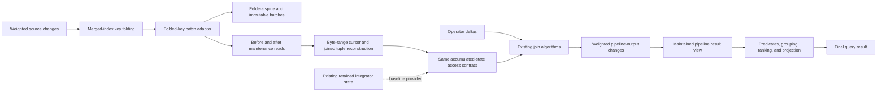
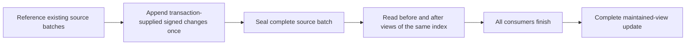

# Reconstructing accumulated state from a merged index

## References and how each helps

This guide lists all sources used by this note and its supporting report, grouped by source file. Detailed
line-level citations remain beside the claims they support. Start with the interesting-orderings manuscript
for general merged-index design, LeanStore for working storage and query execution, and the lecture note
for historical Q3 maintenance examples. The validated `mi_db` scan-session section supplies the sharing design;
validation does not extend to its other sections.
Local links assume the sibling checkout layout; public code links pin the inspected revisions. The modified
`mi_db` design is identified by revision and content hash in the supporting report.

### Design documents

| Reference | How it helps |
| --- | --- |
| [Interesting-orderings manuscript — general design](../../../../merged_index_interesting_orderings/main.tex#L515) | Primary design reference for order-sharing pipelines, heterogeneous folded keys, backend reuse, and the distinction between pipeline output and remaining query work. |
| [Multi-pipeline query execution manuscript](../../../../query_execution_using_MI/main.tex#L88) | Future direction: composing pipelines through intermediate views. Outside this project’s scope; single-pipeline maintenance provides groundwork. |
| [Maintaining a Query, One Change at a Time](../../../../DBSP_w_merged_index/dbsp-merged-index-feasibility.tex#L276) | Historical filtered, aggregate-first Q3 circuit and signed-delta algebra. Its five-state circuit is not the maintained view selected here. |
| [Equivalent Q3 circuits — figure source](../../../../DBSP_w_merged_index/figures/q3-dbsp-circuit.tex#L59) | Documents the historical grouping, delay, and join wiring for comparison. |
| [Operator-state guide](../../../../DBSP_w_merged_index/operator-state.tex#L39) | Historical aggregate-first example of group existence; grouping now belongs to the consuming query. |
| [mi_db validated scan-session design](../../../../mi_db/docs/architecture.md#merged-index-scan-sessions) | The scan-session section is validated. Other sections, including the separate buffer guard, require independent assessment. Spill/reread and Feldera batch-lifetime pseudocode are extensions proposed here. |
| [Interesting-orderings manuscript — experiments](../../../../merged_index_interesting_orderings/sections/experiments_revised.tex#L173) | Defines the refresh workload and reports backend-dependent results, including the LSM comparison. It motivates measuring total maintenance cost rather than assuming a Feldera speedup. |

### Existing Feldera storage and operator behavior

| Reference | How it helps |
| --- | --- |
| [Read/write interfaces — trace.rs](https://github.com/feldera/feldera/blob/f3c06614f53b1c01e0f6b8745d690ad6a2bcac7c/crates/dbsp/src/trace.rs#L231-L308) | Defines weighted collections, the read interface, and insertion of immutable update batches; anchors the interface pseudocode. |
| [Key/value navigation — trace/cursor.rs](https://github.com/feldera/feldera/blob/f3c06614f53b1c01e0f6b8745d690ad6a2bcac7c/crates/dbsp/src/trace/cursor.rs#L42-L109) | Defines key-then-value iteration, forward seeks, borrowed values, and time/weight access. |
| [Spine batch management — trace/spine_async.rs](https://github.com/feldera/feldera/blob/f3c06614f53b1c01e0f6b8745d690ad6a2bcac7c/crates/dbsp/src/trace/spine_async.rs#L1-L7) | Shows the collection of immutable batches and background merging targeted for reuse. |
| [Read snapshots — trace/spine_async/snapshot.rs](https://github.com/feldera/feldera/blob/f3c06614f53b1c01e0f6b8745d690ad6a2bcac7c/crates/dbsp/src/trace/spine_async/snapshot.rs#L23-L43) | Defines snapshot acquisition, batch ownership/composition, and the combined cursor used for a stable read view. |
| [Weight consolidation — trace/cursor/cursor_list.rs](https://github.com/feldera/feldera/blob/f3c06614f53b1c01e0f6b8745d690ad6a2bcac7c/crates/dbsp/src/trace/cursor/cursor_list.rs#L150-L174) | Shows addition of weights across batches and suppression of zero totals in unit-time reads. |
| [File format — storage/file.rs](https://github.com/feldera/feldera/blob/f3c06614f53b1c01e0f6b8745d690ad6a2bcac7c/crates/dbsp/src/storage/file.rs#L3-L65) | Describes immutable nested groups, per-level tree indexes, associated data, and typed comparisons; constrains the merged-index batch adapter. |
| [Memory batches — trace/ord/vec/indexed_wset_batch.rs](https://github.com/feldera/feldera/blob/f3c06614f53b1c01e0f6b8745d690ad6a2bcac7c/crates/dbsp/src/trace/ord/vec/indexed_wset_batch.rs#L158-L199) | Shows sorted keys, value offsets, values, and weights underlying the worked layout example. |
| [Memory/file selection — trace/ord/fallback/indexed_wset.rs](https://github.com/feldera/feldera/blob/f3c06614f53b1c01e0f6b8745d690ad6a2bcac7c/crates/dbsp/src/trace/ord/fallback/indexed_wset.rs#L34-L58) | Confirms that retained indexed state can use either memory or file-backed batches. |
| [File batches — trace/ord/file/indexed_wset_batch.rs](https://github.com/feldera/feldera/blob/f3c06614f53b1c01e0f6b8745d690ad6a2bcac7c/crates/dbsp/src/trace/ord/file/indexed_wset_batch.rs#L447-L478) | Shows batched key fetching and, later in the file, key/value batch construction. Both matter when defining the baseline and adapter boundary. |
| [Timestamp specialization — time.rs](https://github.com/feldera/feldera/blob/f3c06614f53b1c01e0f6b8745d690ad6a2bcac7c/crates/dbsp/src/time.rs#L214-L219) | Shows that root-circuit unit time selects ordinary batches; distinguishes runtime timestamps from merged-index source versions. |
| [Incremental joins — operator/dynamic/join.rs](https://github.com/feldera/feldera/blob/f3c06614f53b1c01e0f6b8745d690ad6a2bcac7c/crates/dbsp/src/operator/dynamic/join.rs#L698-L749) | Establishes delta/current-state and delta/delayed-state wiring, plus the baseline batched-fetch path. |
| [Aggregation — operator/dynamic/aggregate.rs](https://github.com/feldera/feldera/blob/f3c06614f53b1c01e0f6b8745d690ad6a2bcac7c/crates/dbsp/src/operator/dynamic/aggregate.rs#L766-L796) | Explains generic aggregation’s retained-input and previous-output strategy, and explicitly discusses recomputing old values as an alternative. |
| [Output replacement — operator/dynamic/upsert.rs](https://github.com/feldera/feldera/blob/f3c06614f53b1c01e0f6b8745d690ad6a2bcac7c/crates/dbsp/src/operator/dynamic/upsert.rs#L90-L109) | Draws the retained-output feedback used to turn replacement values into old-tuple retractions and new-tuple insertions. |
| [Transaction scheduling — circuit/schedule.rs](https://github.com/feldera/feldera/blob/f3c06614f53b1c01e0f6b8745d690ad6a2bcac7c/crates/dbsp/src/circuit/schedule.rs#L186-L226) | Shows why a transaction may span multiple runtime steps and why one exhausted cursor is not a completion barrier. |
| [Commit handling — circuit/circuit_builder.rs](https://github.com/feldera/feldera/blob/f3c06614f53b1c01e0f6b8745d690ad6a2bcac7c/crates/dbsp/src/circuit/circuit_builder.rs#L7777-L7805) | Provides the commit-flushing behavior that must be considered when retiring old views and publishing batch progress. |

### RocksDB comparison and LeanStore implementation evidence

| Reference | How it helps |
| --- | --- |
| [RocksDB overview](https://github.com/facebook/rocksdb/wiki/RocksDB-Overview) | Supplies the familiar memtable/SST and key-value baseline for the storage comparison. |
| [RocksDB merge operator](https://github.com/facebook/rocksdb/wiki/Merge-Operator) | Explains application-defined update combination; prevents treating weighted addition as a capability RocksDB lacks. |
| [LeanStore B-tree merged-index adapter](https://github.com/alicia-lyu/leanstore/blob/305ad0a98b147d048a37a1eba3787b35b1181b85/frontend/shared/adapter-scanner/LeanStoreMergedAdapter.hpp#L25) | Working B-tree storage with record-specific folded byte keys and payloads. |
| [LeanStore RocksDB merged-index adapter](https://github.com/alicia-lyu/leanstore/blob/305ad0a98b147d048a37a1eba3787b35b1181b85/frontend/shared/adapter-scanner/RocksDBMergedAdapter.hpp#L22) | Working LSM storage for the same merged-index design. |
| [LeanStore Q3 execution](https://github.com/alicia-lyu/leanstore/blob/305ad0a98b147d048a37a1eba3787b35b1181b85/frontend/tpch/q3/query.tpp#L446) | Executes the Customer–Orders–Lineitem scan, per-order aggregation, and final top-10 selection; does not establish the proposed incremental maintenance. |
| [LeanStore Q5 implementation](https://github.com/alicia-lyu/leanstore/blob/305ad0a98b147d048a37a1eba3787b35b1181b85/frontend/tpch/q5/query.tpp#L219-L335) | Shows the external Nation/Region eligibility check, supplier-field use, and actual date bounds that a Q5 comparison must preserve. |
| [LeanStore Q10 logical plan](https://github.com/alicia-lyu/leanstore/blob/305ad0a98b147d048a37a1eba3787b35b1181b85/frontend/tpch/q10/plans/family_logical.dot#L34-L69) | Establishes the selected join boundary and downstream aggregation, without assuming a stored per-order summary. |
| [LeanStore Q10 visitor](https://github.com/alicia-lyu/leanstore/blob/305ad0a98b147d048a37a1eba3787b35b1181b85/frontend/tpch/q10_family/visitor.hpp#L126-L200) | Shows the customer and returned-line payloads needed by downstream consumers. |
| [LeanStore Q10 date bounds](https://github.com/alicia-lyu/leanstore/blob/305ad0a98b147d048a37a1eba3787b35b1181b85/frontend/tpch/q10/query.tpp#L100-L107) | Supplies the concrete day-offset predicate, which must be matched rather than assumed equivalent to a calendar interval. |
| [LeanStore refresh discovery](https://github.com/alicia-lyu/leanstore/blob/305ad0a98b147d048a37a1eba3787b35b1181b85/frontend/tpch/tpch_family/refresh.hpp#L143-L178) | Shows RF2 parent lookup and line-number discovery; clarifies what additional payload retention is needed to share these reads. |
| [LeanStore merged-index maintenance](https://github.com/alicia-lyu/leanstore/blob/305ad0a98b147d048a37a1eba3787b35b1181b85/frontend/tpch/tpch_family/col_pipeline.tpp#L150-L220) | Shows insertion and erasure paths whose read/write work must be included in maintenance accounting. |

### Detailed explanations in this repository

| Reference | How it helps |
| --- | --- |
| [Storage differences from RocksDB](support.md#storage-differences-from-rocksdb) | Connects the baseline comparison to concrete storage sources. |
| [Trace access traverses keys then weighted values](support.md#trace-access-traverses-keys-then-weighted-values) | Provides interface pseudocode, an array layout, traversal/lookup examples, and interchangeable read providers. |
| [Folded keys in Feldera layer files](support.md#folded-keys-in-feldera-layer-files) | Defines the record representation and weighted-update requirements for reusing the LSM machinery. |
| [Shared scan sessions bound ownership and memory](support.md#shared-scan-sessions-bound-ownership-and-memory) | Specifies owner/view lifetime, ordering, reader positions, borrowed records, and bounded overflow behavior in pseudocode. |
| [Merged index reconstructs integrator outputs](support.md#merged-index-reconstructs-integrator-outputs) | Maps predicate-free join state to reconstruction routines and the existing join operator contract. |
| [Weighted reconstruction preserves group existence](support.md#weighted-reconstruction-preserves-group-existence) | Explains signed multiplicity and defers grouped existence to the consuming Q3 query. |
| [Immutable batches preserve old reads](support.md#immutable-batches-preserve-old-reads) | Separates existing snapshot primitives from the publication/recovery behavior the adapter must implement. |
| [Consumers determine the required payload](support.md#consumers-determine-the-required-payload) | Summarizes Q5/Q10 requirements that prevent replacing every requested relation with a revenue total. |
| [Refresh reads can serve reconstruction](support.md#refresh-reads-can-serve-reconstruction) | Identifies shareable RF1/RF2 work and the limits of existing refresh evidence. |
| [Evidence and measurements bound the claim](support.md#evidence-and-measurements-bound-the-claim) | Records source provenance, acceptance criteria, and the measurements still needed. |

## How Feldera stores indexed state

> [!NOTE]
> **Glossary**
>
> **Retained state** — An integrator's accumulated output stored and maintained across input updates.
> Reads obtain its tuples from that maintained collection, which may reside in memory or files.
>
> **Reconstructed state** — The same integrator output computed for requested keys and a before/after view
> from stored weighted source records, instead of maintaining that output as a separate collection.
>
> Both supply the same tuples, weights, group presence/absence, and cursor ordering to the existing IVM
> path. Neither term refers to reconstructing input deltas. Reconstructed state still depends on retained
> source data and may use bounded temporary buffers; the distinction is how the integrator output is supplied.
>
> **root circuit** — top-level operator graph.
>
> **Order-sharing pipeline** — Consecutive query operators that use compatible tuple orderings.
>
> **Residual execution** — Query work performed over the maintained pipeline result to produce the final result.

Reuse Feldera's LSM machinery with folded byte keys and weighted payload rows for the merged index. Reconstruct
accumulated relations from that store while preserving join and aggregation algorithms. The adapter changes
record representation and accumulated-state access; it does not require a separate LSM implementation.
The target is maintenance of the result of one **order-sharing pipeline** in a nonrecursive **root circuit**.
Its maintained view needs **residual execution**: Q3's predicates, revenue aggregation, ordering, limit,
and projection run in the consuming query.
The [interesting-orderings design](../../../../merged_index_interesting_orderings/main.tex#L751)
explicitly allows a pipeline to be only part of a query. Internal integrator reconstruction does not remove
the maintained pipeline result. Rust interfaces and implementation are subsequent work.
Composing multiple pipelines is outside scope; this project provides groundwork for the
[multi-pipeline query execution design](../../../../query_execution_using_MI/main.tex#L88).

Compared with RocksDB, the relevant differences are the update semantics and the representation supplied to
storage:

> [!NOTE]
> **Glossary**
>
> **Z-set** — relation with signed tuple multiplicities.
>
> **batch** — immutable sorted collection of weighted updates, in memory or a file.
>
> **spine** — Feldera's collection of immutable batches and background merger.

| Aspect | RocksDB | Feldera |
| --- | --- | --- |
| Update semantics | `Put` replaces a key's value; `Delete` removes it. An application-defined `Merge` operator can combine updates. | A **Z-set** adds weights for identical complete tuples and drops zero totals. An indexed Z-set groups weighted values by key. |
| Unit supplied to accumulated storage | Ordinary writes enter a mutable memtable before becoming immutable sorted runs. | A **batch** enters a **spine**. A storage batch is distinct from an input update batch. |
| Indexed record layout | A sorted key-to-value mapping. | `K → {V → weight}`: each search key has a sorted group of weighted values; equivalently, `(K,V) → weight`. |

> [!NOTE]
> **Glossary**
>
> **columns** — storage nesting levels, not SQL attributes.
>
> **Trace** — Feldera's name for its interface to retained, weighted state. The name appears in its code;
> this design does not require provenance from a particular research system.

For a join keyed by customer ID, `K` is that ID and each `V` can be a complete order tuple. Each file-backed
batch indexes keys and nested value groups. The format calls these levels **columns**. The outer level is ordered by
`K`; within each fixed `K`, values are ordered
by `V`. Inner seeks compare `V`, and consolidation combines weights for identical `(K,V)` tuples across batches.
This describes existing operator state.
Feldera exposes retained state through the **trace** interface. `Spine` implements this interface
by holding immutable sorted batches and merging them in the background. See [Storage differences from
RocksDB](support.md#storage-differences-from-rocksdb).
An incoming operator delta can be buffered in memory, while an immutable storage batch can be memory backed
or file backed. Once the adapter appends complete pending changes to the same merged index, its cursor can
seek them before view maintenance. File backed batches remain on disk; cursors read indexed blocks as needed.
Snapshot references do not load every referenced batch into memory.
[Trace access traverses keys then weighted values](support.md#trace-access-traverses-keys-then-weighted-values)
shows interface pseudocode, array layout, cursor traversal, and the merged-index adapter.

In this root circuit, logical time has a single value, written `()` in Rust, so records need no varying
logical timestamp. Feldera's file batches also support fetching multiple requested keys together; retain
that optimization in the baseline comparison.

## What changes in our design

The [Step 2 storage plan](folded-key-layer-file-plan.md) records the current implementation contract and the
user's clarifications: folded keys, weighted payload rows, transaction-supplied related-row
changes, and temporary read handles without multi-versioning or expiration policies.

> [!NOTE]
> **Glossary**
>
> **Folding** — Encoding a source's key fields into bytes using a rule owned by a particular
> merged index.

Following the [primary folded-key design](../../../../merged_index_interesting_orderings/main.tex#L545),
the merged index uses standard KV storage: `index.fold(source, record) → encoded_value`.
**Folding** produces the byte key. The Customer–Orders–Lineitem index defines each source's
source roster, ordered key fields, and shared domains in its
[constitution](folded-key-layer-file-plan.md#merged-index-constitution). Its logical
customer-leading positions are `(c)`, `(c,o)`, and `(c,o,l)`. Another merged index may fold
one of these sources differently. A generic `MergedIndex<D>` base will hold shared folding and
storage behavior; `CustomerOrdersLineitemIndex` wraps it with this index's definition. The
storage layer compares opaque byte strings lexicographically. It does not expose those fields
as nested groups.
The encoding must preserve the intended cross-type ordering and let the access layer construct range bounds.

Each value contains one regular payload and its signed weight. The index
identifier in the folded key determines the record type; `INDEX` is its domain tag, not an extra end marker.
At a completed transaction boundary, each folded K has at most one active payload. A replacement
delta can carry negative and positive contributions with the same K; a post-append read can return
multiple nonzero payloads for that K. Before transaction completion, validate unique active K values.
The raw cursor returns all rows.
Feldera's layer-file columns store folded K and its weighted payload rows; no payload list or key suffix
is added.
A range cursor reads KV entries in byte-key order and
decodes the fields needed by the requesting operator. For Q3, it streams one order's source rows to supply
requested joined tuples before and after maintenance. It does not build an in-memory relation containing
all those lines.
The transaction supplies complete extended records and any intended related-row changes. Storage does not
add an `OrderParent` record, perform reverse-parent lookup, or move child rows automatically. Reuse the spine, batch
management, compaction, cache, and snapshots; adapt the record format, byte comparison, and weighted-value
merge rules. The planned batch uses Feldera's existing two-column layer-file layout.
Payload replacement must preserve both payloads and signed changes; ordinary last-write-wins handling alone
cannot implement weighted reconstruction. [Folded keys in Feldera layer
files](support.md#folded-keys-in-feldera-layer-files)
defines this boundary and the remaining adapter work.

> [!NOTE]
> **Glossary**
>
> **integrator state** — retained results of accumulating changes.

The integration boundary is **accumulated-state access**: for requested keys and the state before or after
maintenance, return the
same tuples, weights, ordering, and absence information that existing **integrator state** would supply. The provider
scans encoded ranges to derive those tuples. Operator
code consumes them through the same access contract, whether they were retained or reconstructed.

The existing incremental view maintenance (IVM) algorithm determines the output: an additive summary can
emit a tuple carrying a value difference; a replacement emits `-[[old_tuple]] + [[new_tuple]]`, where `[[t]]`
denotes one copy of tuple `t`. The merged index can supply state for either algorithm. Choosing the delta
form and computing it remain in the shared operator path. Returned tuples are streamed or buffered within
a byte limit, without storing another complete accumulated relation.

> [!NOTE]
> **Glossary**
>
> **Sealing** — Making the complete pending update set immutable and available to readers.



One storage owner appends each complete input delta to the same index before view maintenance, publishes
consistent views, and keeps them alive for every
consumer. Provider cursors seek encoded ranges and return the requested state through the shared contract. When
byte-key order differs from the required operator order, use budgeted external sorting or a maintained access
path and count its I/O. Each shared scan has a byte-limited buffer and per-consumer positions; a lagging
consumer must cause backpressure, spilling, or rereading, rather than unbounded retention.
[Shared scan sessions bound ownership and memory](support.md#shared-scan-sessions-bound-ownership-and-memory)
gives pseudocode for batch lifetime, provider requests, reader positions, ordering, and overflow handling.
Its scan-sharing basis is the validated `mi_db` scan-session section; the Feldera lifecycle and overflow
extensions remain proposals.

The reconstruction target is each requested accumulated relation in the predicate-free join pipeline,
not its input delta stream. For Q3 those relations are `O`, `C`, `B = O ⋈ C`, and `L`; the maintained
pipeline output is `J = B ⋈ L`. Join equalities define the relationships among records. Segment and date
predicates are applied when a query consumes `J`. The [lecture note's filtered, aggregate-first Q3
circuit](../../../../DBSP_w_merged_index/dbsp-merged-index-feasibility.tex#L276) is a historical alternative,
not the selected maintained view. [Merged index reconstructs integrator
outputs](support.md#merged-index-reconstructs-integrator-outputs) defines the active join-state requests.

## How Q3 works with reconstructed state

Maintain the unfiltered, unaggregated Customer–Orders–Lineitem join. Let `O` contain all Orders, `C` all
Customers, and `L` all extended Lineitems. `B = O ⋈ C` joins on customer ID; `J = B ⋈ L` joins on
order ID and the supplied extended key. A valid transaction supplies any related row changes needed to
keep its extended keys consistent. The storage layer does not infer them.

| Accumulated relation | Required fields and multiplicity | Source access |
| --- | --- | --- |
| `O` | Order ID, customer ID, order date, ship priority, signed weight | Order records. |
| `C` | Customer ID, market segment, signed weight | Customer records. |
| `B = O ⋈ C` | All fields above, with joined weight | Customer and order prefixes. |
| `L` | Customer ID, order ID, line ID, ship date, extended price, discount, signed weight | Extended line records. |
| Maintained `J = B ⋈ L` | Customer, order, and line identities; market segment, order date, ship priority, ship date, price, and discount; joined weight | The pipeline output, maintained incrementally. |

Line identity stays in `J`: two lines with identical visible Q3 fields still represent two joined rows.
Neither source scans nor the maintained join apply market-segment or date predicates. Q3's consuming query
filters `J`, computes `SUM(extended_price * (1 - discount))` per order/date/priority, then orders by revenue
and order date and takes the first ten rows. In SQL-like notation:

```sql
SELECT order_id, SUM(extended_price * (1 - discount)) AS revenue,
       order_date, ship_priority
FROM J
WHERE market_segment = :segment
  AND order_date < :cutoff
  AND ship_date > :cutoff
GROUP BY order_id, order_date, ship_priority
ORDER BY revenue DESC, order_date
LIMIT 10;
```

The before-maintenance state excludes pending source changes; the after-maintenance state includes them.
For a joined relation, Feldera's incremental join uses a before-state input on one branch and an
after-state input on the other, so simultaneous changes contribute once. If a line changes price and its
customer changes segment in the same supplied update set, the maintained `J` retracts the old joined row
and inserts the new joined row. The consuming Q3 query then evaluates its predicates on the resulting rows.
The [weighted reconstruction rules](support.md#weighted-reconstruction-preserves-group-existence)
and existing operator bindings determine the signed weights; the storage adapter does not choose a new join
algorithm.

> [!NOTE]
> **Glossary**
>
> **support** — tuples with nonzero weight.

One traversal of an order range can supply line tuples to multiple join-state readers and reuse decoded
parent payloads. A customer change affects its descendant orders in the before and after states. Discover
affected identities from the **support** of complete signed changes: projecting a replacement to K and
summing first can cancel its weights and hide a changed row. Consumers share decoded
records but need independent positions. A slow consumer can pin buffers, so bounded sharing must account for
spilling or rereading oversized ranges.

> [!NOTE]
> **Glossary**
>
> **Rekeying** — Moving records to a changed physical key prefix.



Before-maintenance reads use the snapshot taken before the append. After-maintenance reads use the snapshot
taken afterward, which includes the signed changes. The same input delta remains available separately to
the existing operators. No record status bit is needed: snapshot membership determines which contributions
each read sees. If `B` is the pre-append index state and `D` the signed delta, the manuscript's `R−`
is read from `B` and `R+` from `B + D`. A negative weight in `D` retracts an old payload in `R+`;
it does not place that delta record in `R−`. See the
[runtime compatibility contract](folded-key-layer-file-plan.md#compatibility-with-feldera-operators).
The transaction explicitly supplies any intended Lineitem placement changes; storage neither invents
related-row updates nor enforces relational consistency. Completion does not append the same delta again.
Snapshots reference existing batches without copying their tuples or files.
[Immutable batches preserve old reads](support.md#immutable-batches-preserve-old-reads) explains the lifecycle
requirements and what remains to implement.

Q5 and Q10 add two useful constraints. Q5 needs a consistently observed external Nation/Region relation
and line supplier identifiers. Q10 needs returned line rows and customer payloads for downstream work.
The maintained Q3 join likewise retains the source fields needed by its consuming query.
See [Consumers determine the required payload](support.md#consumers-determine-the-required-payload).

## Why this could improve I/O

The expected saving comes from avoiding retained intermediate collections and their writes. Source changes
still incur KV update, consolidation, and persistence work, but reconstructed `B` need not have
separate accumulated storage. Co-location also lets several logical consumers use one physical range read.
Neither benefit implies that every update becomes cheaper.

Refresh processing offers another sharing opportunity. RF1 inserts an order and its lines: customer reads
can serve the join, and appended rows can supply after-state reconstruction. RF2 supplies deletion changes
for an order and its lines: before-state range reads can supply operator inputs. The cited LeanStore workload
also performs native-order discovery; that is reference behavior, not a required lookup in this Q3 adapter.
Sharing reads requires keeping full decoded payloads until consumption; discovery that
collects only identifiers does not achieve that reuse.
[Refresh reads can serve reconstruction](support.md#refresh-reads-can-serve-reconstruction) distinguishes the
existing refresh behavior from the proposed sharing.

Reconstruction trades writes and persistent intermediate bytes for reads, decoding, and computation. A single
line change may rescan all `f` lines of its order; a customer change may visit every descendant. Transaction-supplied
key changes write the supplied before and after placements. Temporary read handles, incoming batches, shared buffers,
and any additional ordering increase memory or peak storage. Existing Feldera traces may answer selective
probes more cheaply, especially with cached or batched fetches.

Judge the design against unmodified Feldera with identical results, updates, memory budgets, and comparable
durability. Measure actual read/write bytes, repeated reads, seeks, decoded records, CPU, peak memory and
storage, and complete-batch latency. Include any workload-side refresh discovery, staging, compaction,
checkpointing, spills, and writes to the maintained pipeline result. Hold residual query execution constant
and report its cost separately from maintenance. The union of touched blocks describes potential reuse;
device read events measure realized traffic. Test beyond-memory state with both localized refresh groups
and scattered updates, including
large descendant ranges.

The design sources specify weighted reconstruction semantics; implementation correctness, recovery, and
the I/O improvement remain to be established. First verify reconstructed integrator outputs and IVM deltas
against independent evaluation, then verify snapshot and scheduling behavior, and finally measure total maintenance cost.
[Evidence and measurements bound the claim](support.md#evidence-and-measurements-bound-the-claim) gives the
source provenance and implementation acceptance criteria.

## Next Steps

1. **Bind the Q3 state requests.** Map the predicate-free join circuit's `O`, `C`, `B`, and `L` accesses to concrete
   runtime read sites, including before/after maintenance state and cursor operations. Specify the Rust adapter interfaces
   from the [trace-access pseudocode](support.md#trace-access-traverses-keys-then-weighted-values). Keep delta
   streams and IVM computation shared between retained and reconstructed state providers.
2. **Implement folded-key batches on the existing LSM.** Follow the [detailed storage plan](folded-key-layer-file-plan.md):
   paper-defined folded keys and values containing one payload and signed weight. Reuse
   existing file columns; implement record cursor access and the spine's batch/merge contracts. Append the supplied delta
   once before view maintenance; use reference-only read handles. Verify replacements, signed updates,
   transaction-supplied key changes, and before/after snapshots. No parent lookup, storage-generated
   child moves, multi-versioning, or expiry mechanism is part of this step. Typed scan sessions follow in Step 3.
3. **Implement reconstruction and bounded scan sharing.** Supply per-integrator routines, then connect them
   through the [session protocol](support.md#shared-scan-sessions-bound-ownership-and-memory). Choose explicit
   buffer limits, overflow handling, and ordering paths. Verify consumer progress, borrowed-value lifetimes,
   batch publication, and commit/recovery behavior with ranges larger than the memory budget.
4. **Verify the complete Q3 path.** Run identical updates through retained and reconstructed providers.
   Compare each requested state and maintained `J` against independent evaluation. Include simultaneous
   source changes, replacements, duplicate visible Q3 fields on distinct lines, and supplied key moves.
   Confirm that replaced integrator state is not still being accumulated elsewhere. Verify the consuming
   query's predicates, aggregation, ordering, and limit over `J` separately.
5. **Measure total maintenance cost.** Benchmark against unmodified Feldera beyond RAM with equal total
   memory and comparable durability. Include RF1/RF2, scattered line updates, customer fan-out, and rekeys.
   Account for all reads, writes, sorting, spill, repeated scans, and background work using the
   [measurement criteria](support.md#evidence-and-measurements-bound-the-claim). Report correctness and
   performance separately; extend to the stated Q5/Q10 boundaries after the Q3 path is validated.
