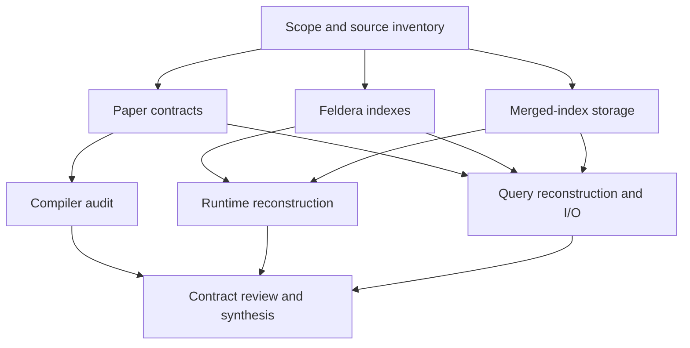

# Investigation orchestration

Date: 2026-09-28. This file owns assignments and progress; the human entry point is [README.md](../../../../TRASH/docs/design/merged-index/README.md).
The [plan](investigation-plan.md) records acceptance.

## Assignments

| Agent | Requested model / effort | Exclusive ownership | Status |
|---|---|---|---|
| Coordinator | GPT-6 Astra / High | Overview, plan, orchestration, source map, synthesis | Complete |
| A — Paper contracts | GPT-6 Sol / High | `reports/paper-contracts.md` | Complete; incorporated in synthesis |
| B — Feldera indexes | GPT-6 Sol / Xhigh | `reports/feldera-indexes.md` | Complete; baseline/proposal distinction reviewed |
| C — Merged-index storage | GPT-6 Sol / High | `reports/merged-index-storage.md` | Complete; physical protocol reviewed |
| D — Compiler | GPT-6 Sol / Xhigh | `reports/compiler-control.md` | Complete; contract cross-review incorporated |
| E — Runtime reconstruction | GPT-6 Astra / High | `reports/runtime-reconstruction.md` | Complete; contract reviewed |
| F — Reconstruction and I/O | GPT-6 Astra / Xhigh | `reports/query-reconstruction.md`, weighted examples, validation plan | Complete; formulas and I/O cross-reviewed |

Models above are the requested assignments. The coordinator runs in the supplied session; model selection does
not constitute technical evidence. At most three research agents run alongside it. Each report has one writer;
review corrections are sent to its owner. Agents do not commit independently: the coordinator stages named
files and fetches/merges before each commit.

## Contract checkpoint

A, B, and C ran concurrently. D started after A completed. E started after C completed and B supplied its
source-backed runtime handoff; F started when B completed. This used available handoffs without exceeding
three research agents.

Handoffs must identify citations, findings, uncertainties, and consequences. D supplies compiler audit
findings and limits for optional later integration; E supplies runtime snapshot and scheduling contracts; F
supplies reconstruction and access requirements. Review must distinguish five Q3 logical accumulations from
actual optimized Feldera traces, and distinguish a semantic base/pending model from a physical new/old-bit
implementation.

The user refined the route to explicit circuit composition. Compiler shape control is no longer a prototype
gate. The source audit corrected an initial inference from the `TimedSpine` name: root time is unit and root
file batches can support batched fetch. Timestamp histories concern nested clock scopes, not this prototype.

## Contract review outcomes

The compiler reviewer checked the overview, index inventory, and runtime report;
the runtime reviewer checked all of F's reconstruction expressions. The coordinator
incorporated corrections after each owner's handoff and checked the full package.
The review established:

- Q3 retains unique unit-weight parents for the aggregation-first SQL equivalence;
  legal-key projection examples demonstrate multiplicity, while broader bag
  algebra is explicitly supplemental.
- Q5's external Nation/Region gate is supplied consistently or fixed; Q10's
  customer aggregate and Nation attachment remain downstream.
- Hand-composed circuits are the first route. Compiler selection is optional.
- Root joins specialize to untimed batches and can use file batched fetch.
  Nested clock behavior is outside the selected scope.
- Pending data is sealed only after parent-derived rekeys are staged. Finalization
  waits for all consumers, not merely an exhausted cursor or a single step.
- The I/O comparison includes actual read events, shared unique-block footprints,
  all memory, parent paths, RF1/RF2 discovery, staging, folding, and durability.

## Verification record

Existing semantic checks passed: 12 Q3 methods and 8 operator-family methods.
All three Mermaid diagrams passed the Mermaid parser. Twelve Markdown files
passed markdownlint with a 120-character prose limit and table/code exceptions;
212 local and pinned-source link targets and line ranges were checked against
the supplied checkouts. `git diff --check` passed. The overview is below 600
prose words, excluding its table and diagram.

Source revisions and reproducibility details belong in
[source-map.md](../../../../TRASH/docs/design/merged-index/evidence/source-map.md); future experiments belong in
[validation-plan.md](../../../../TRASH/docs/design/merged-index/evidence/validation-plan.md). No runtime prototype or I/O
benchmark was executed. The intended `alicia-lyu/feldera` upstream is pending
creation; these documentation commits remain local.
