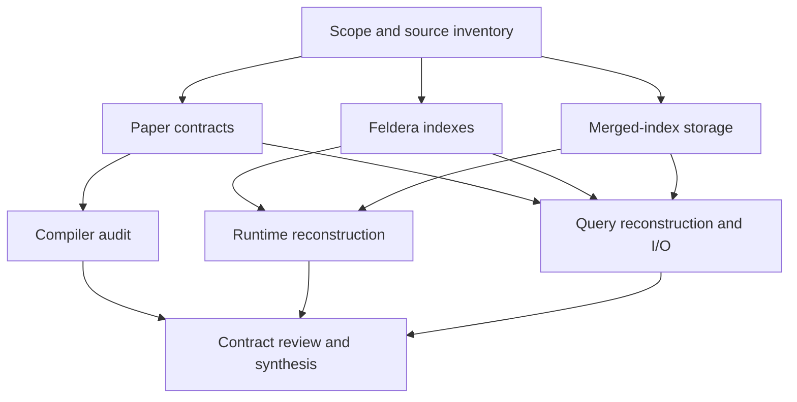

# Investigation orchestration

Date: 2026-09-28. This file owns assignments and progress; the human entry point
is [README.md](README.md). The [plan](investigation-plan.md) records acceptance.

## Assignments

| Agent | Requested model / effort | Exclusive ownership | Status |
|---|---|---|---|
| Coordinator | GPT-6 Astra / High | Overview, plan, orchestration, source map, synthesis | In progress |
| A — Paper contracts | GPT-6 Sol / High | `reports/paper-contracts.md` | In progress; semantic handoff received |
| B — Feldera indexes | GPT-6 Sol / Xhigh | `reports/feldera-indexes.md` | In progress |
| C — Merged-index storage | GPT-6 Sol / High | `reports/merged-index-storage.md` | In progress; storage handoff received |
| D — Compiler | GPT-6 Sol / Xhigh | `reports/compiler-control.md` | Pending A's slot |
| E — Runtime reconstruction | GPT-6 Astra / High | `reports/runtime-reconstruction.md` | Pending B/C |
| F — Reconstruction and I/O | GPT-6 Astra / Xhigh | `reports/query-reconstruction.md`, weighted examples, validation plan | Pending B/C |

Models above are the requested assignments. The coordinator runs in the supplied
session; model selection does not constitute technical evidence. At most three
research agents run alongside it. Each report has one writer; review corrections
are sent to its owner. Agents do not commit independently: the coordinator stages
named files and fetches/merges before each commit.

## Contract checkpoint

Handoffs must identify citations, findings, uncertainties, and consequences.
D supplies selected pipeline shapes and compiler control limits; E supplies
runtime snapshot and scheduling contracts; F supplies reconstruction and access
requirements. Review must distinguish five Q3 logical accumulations from actual
optimized Feldera traces, and distinguish a semantic base/pending model from a
physical new/old-bit implementation.

## Verification record

Pending final synthesis. Source revisions and reproducibility details belong in
[source-map.md](evidence/source-map.md); planned experiments belong in
[validation-plan.md](evidence/validation-plan.md).
