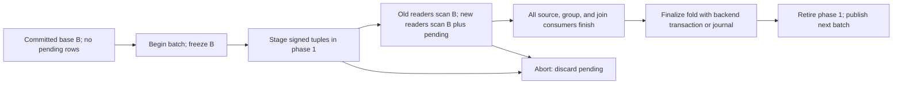

# Merged-index storage and batch visibility

**Conclusion.** A single ordered merged index can supply the old and new source relations needed by an
incremental Q3 pipeline if it stores weighted typed tuples directly, retains a stable committed side during
each batch, and keeps pending changes separately addressable until every consumer finishes. The co-location
and cursor mechanics have precedents in the inspected systems; the weighted, two-phase visibility and batch
finalization contract is proposed, not implemented in those systems. This report covers one pipeline and
excludes compaction-driven maintenance.

| Finding | Status | Consequence |
| --- | --- | --- |
| Tagged customer/order/line records sort as `customer → (order → line*)+`, and Q3, Q5, and Q10 use a shared COL walk. | **Implemented** in LeanStore | Reuse the tagged-order and visitor pattern for ordered source access. |
| B-tree and RocksDB merged adapters expose typed inserts, point access, and ordered scanners. | **Implemented** in LeanStore | The engines can host a disk-backed ordered index, but their current records have no weights or batch phase. |
| Independent scan sessions, same-type accessor positions, and bounded demultiplexing are specified. | **Proposed** in `mi_db` | Reuse the session contract; it is not an old/new visibility mechanism. |
| A stable base plus pending signed changes reconstructs before and after relations by complete tuple identity. | **Semantically demonstrated** in the DBSP Q3 checker; **proposed** physical encoding here | Old payloads and both old/new placement paths remain available throughout a batch. |
| Existing RF1/RF2 helpers insert or erase the COL entry alongside the base table. | **Implemented** in LeanStore | They establish key construction but do not provide simultaneous old/new versions. |
| Bounded-memory range reconstruction, transaction isolation, crash recovery, and performance at scales beyond RAM. | **Unverified** for this design | Require backend conformance and end-to-end measurements. |

## Scope and physical record

The proposed index holds the directly stored, projected source tuples for one customer/order/line pipeline,
each with a signed 64-bit multiplicity. A record has a typed hierarchical key, the native primary identity,
all payload fields required to distinguish the logical tuple, an **independent one-bit phase**, and the
weight. Phase `0` is the stable committed base used for the old read; phase `1` is this batch's pending delta
used with the base for the new read. The bit is separate from the sign or magnitude of the weight. An
unchanged base tuple belongs to both views without a second copy. An insertion is a positive pending weight; a
deletion is a negative pending weight while the old base payload remains stored. A replacement has both signs
on different complete tuples.

One possible ordered key is `(tagged customer/order/line path, row type, native primary identity, canonical
complete tuple bytes, phase)`. The exact codec is a design choice, but it must put all versions of one native
identity in a bounded range, compare the complete logical tuple without collisions, and retain the tagged
prefix order. The tuple payload may be partly in the key and partly in the value only if the scanner can still
consolidate equal complete tuples without keeping an unbounded group in RAM. Repeated equal tuples consolidate
by adding their weights; changing a payload field never mutates an old tuple in place. Reject signed overflow
and a negative resulting committed multiplicity. Native identity and physical placement are distinct: moving
an order to another customer also moves its unchanged descendant line entries between prefixes.

For type `X` and complete tuple `x`, with `B_X(x)` the phase-0 weight and `D_X(x)` the phase-1 weight, expose:

```text
old_X(x) = B_X(x)
new_X(x) = B_X(x) + D_X(x)
```

Only nonzero consolidated weights are returned. A scan reads the relevant ordered range from the storage
engine and groups by full tuple identity, then applies the requested phase view. Thus the storage index itself
may exceed memory; the scanner holds only the current identity group, cursor state, and explicitly budgeted
typed buffers. Large joins or whole customer groups may still demand operator memory or repeated I/O. The
design promises correctness with a bounded scanner, not a constant total query memory bound or cheap I/O. The
existing COL loader builds an in-memory `orderkey → custkey` map at load time; an update-capable,
beyond-memory implementation needs a persistent parent lookup or equivalent indexed path instead.

## Batch lifetime and visibility



The pending batch is sealed before readers start. All readers of that batch share one logical old/new boundary
even if they have independent physical cursors. No fold or phase-1 deletion occurs while any consumer can
still seek an old payload, a deleted row, or either side of a moved prefix. Finalization consolidates each
tuple once, removes zeros, commits the new phase-0 state and pending retirement as one recoverable operation,
and advances the batch identifier. This requires a suitable backend transaction or write-ahead journal; an
atomic wholesale index rewrite is not assumed. A failed batch must leave the old base intact. Atomicity, crash
recovery, and visibility to concurrent queries remain unverified for this design and need backend tests. There
is no background compaction step in this maintenance protocol.

The following trace shows why the phase bit cannot be inferred from the weight. Initially order 10 belongs to
customer 1 and has line 1 with revenue 100 and line 2 with revenue 40. In one batch, order 10 moves to
customer 2; line 1's revenue becomes 130, while line 2's logical tuple stays unchanged. Every line must still
move to the new physical prefix.

| Physical entry during the batch | Phase | Weight | Old read | New read after consolidation |
| --- | ---: | ---: | ---: | ---: |
| Order 10 under customer 1 | 0 | +1 | +1 | 0 after pending −1 |
| Order 10 under customer 1 | 1 | −1 | — | contributes −1 |
| Order 10 under customer 2 | 1 | +1 | — | +1 |
| Line 1, revenue 100, under customer 1 | 0 | +1 | +1 | 0 after pending −1 |
| Line 1, revenue 100, under customer 1 | 1 | −1 | — | contributes −1 |
| Line 1, revenue 130, under customer 2 | 1 | +1 | — | +1 |
| Line 2, revenue 40, under customer 1 | 0 | +1 | +1 | 0 after pending −1 |
| Line 2, revenue 40, under customer 1 | 1 | −1 | — | contributes −1 |
| Line 2, revenue 40, under customer 2 | 1 | +1 | — | +1 |

An old range scan produces order 10 and revenue 140 under customer 1. A new range scan produces order 10 and
revenue 170 under customer 2. Both are available until the consumers emit the old contribution's retraction
and the new contribution's insertion. Simply overwriting the order or setting a flag on its current row loses
the old prefix and fails this trace. Pending `−1` is a true logical retraction, not a deletion of the old
physical entry yet.

## Reconstructing accumulated access

The five Q3 logical accumulations are Count/Revenue, group relation `A`, eligible Orders, joined relation `B`,
and eligible Customers. The [semantic contract](paper-contracts.md) gives their definitions; [query
reconstruction](query-reconstruction.md) covers the weighted derivation and affected-key proof. Storage must
reconstruct each requested old or new accumulated input with the same multiplicity and aggregate existence as
ordinary evaluation. In particular, count distinguishes an absent group from a present zero-revenue group, and
delayed branches must see the old view while current branches see the new view.

The storage access paths must reach both placements of a changed line or order and enumerate descendant orders
under a changed customer in both views. This requires parent lookup, reverse lookup from native order key to
the customer-leading prefix, and complete descendant range scans. A changed customer can touch many orders,
and a changed line can force a full order-line range scan. Co-location improves locality but gives no
constant-work claim. Q5 and Q10 reuse the physical COL grouping and scan order; their predicates, side-table
probes, and aggregates remain in their own visitors.

The scanner/session boundary should return typed, weighted tuples under an explicit old or new view. A
query-local session owns its cursor, range and typed demultiplexing buffers. Multiple accessors of one type
need independent positions over the same decoded buffer; a second range needs a second session. The storage
layer performs visibility and tuple consolidation. Operators own eligibility, group retention, join matches,
and result multiplication. A session's pending-buffer guard can fail a poorly coordinated plan explicitly; it
cannot silently discard records to satisfy its memory budget.

## Reuse boundary and missing contracts

The LeanStore COL path demonstrates the tagged order, typed payload dispatch, per-query visitors, and
per-record RF1/RF2 key construction. It works over a B-tree or RocksDB iterator and runs Q3, Q5, and Q10
through the shared `col_group_walk`. These are reusable implementation patterns. Its current `populate_merged`
is a full three-pass replay, including an in-memory parent map; the merged adapters store one ordinary record
per key, and refresh helpers apply direct insert/erase. None implements signed tuple versions, stable old/new
reads, phase-bit consolidation, retained deletes, or one-shot batch finalization.

The `mi_db` architecture specifies backend-neutral bounded scans and a query-local merged-index session with
independent typed accessors. It is a design, not a working adapter here, and its session buffers demultiplex a
physical stream; they do not make a DBSP integrator or a historical trace. The DBSP Q3 model demonstrates
base-plus-pending semantics and affected-key reconstruction. It explicitly leaves the storage engine, runtime
trace integration, and performance unimplemented. Replacing a runtime integrator's trace access requires an
explicit interface for old/new version selection, key-restricted reconstruction, batch barriers, and ownership
of delayed state. The proposed index does not itself provide arbitrary historical versions, runtime
scheduling, or compaction-based trace maintenance.

The next implementation gates are a collision-free codec and weight policy; backend-equivalent bounded
range/point access and transaction snapshots; atomic staging, rollback, and fold; parent/reverse paths; and
directed tests for replacement, deletion, reassignment, unchanged descendants, simultaneous source changes,
duplicate tuples, empty groups, and interrupted finalization. Measure pages read and cache effects with an
index larger than RAM before making a performance claim.

## Source ledger

The [source map](../evidence/source-map.md) records checkout revisions and content hashes. Source line
references below are to the inspected working trees; `mi_db` had modified documentation, including
`docs/architecture.md`, so its checkout revision alone does not identify the text cited here.

| Source and symbol | Relevant lines | Evidence |
| --- | --- | --- |
| [mi_db `architecture.md`, backend-neutral storage and `MergedIndexScanSession`](../../../../../mi_db/docs/architecture.md#L108) | 108–165, 193–271 | Proposed scan bounds, independent sessions, shared typed buffers, and pending-buffer guard. |
| [LeanStore `views_col.hpp`, `lineitem_col_t::Key`](../../../../../leanstore/frontend/tpch/tpch_family/views_col.hpp#L86) | 31–38, 86–169 | Implemented tagged hierarchy and projected line payload. |
| [LeanStore `col_pipeline.tpp`, `populate_merged`, `col_group_walk`](../../../../../leanstore/frontend/tpch/tpch_family/col_pipeline.tpp#L49) | 49–105, 261–338 | Implemented three-pass load, in-memory parent map, ordered visitor walk. |
| [LeanStore `col_pipeline.hpp`, RF1/RF2 helpers](../../../../../leanstore/frontend/tpch/tpch_family/col_pipeline.hpp#L126) | 126–149 | Implemented direct single-record insert/erase interface. |
| [LeanStore `LeanStoreMergedAdapter.hpp`, `insert`, `tryLookup`, `getScanner`](../../../../../leanstore/frontend/shared/adapter-scanner/LeanStoreMergedAdapter.hpp#L45); [scanner `next`, `seekJK`](../../../../../leanstore/frontend/shared/adapter-scanner/LeanStoreMergedScanner.hpp#L31) | 45–105, 245–248; 11–125 | Implemented B-tree access and cursor mechanics. |
| [LeanStore `RocksDBMergedAdapter.hpp`, `insert`, `erase`, `getScanner`](../../../../../leanstore/frontend/shared/adapter-scanner/RocksDBMergedAdapter.hpp#L41); [scanner `seekJK`, `next`](../../../../../leanstore/frontend/shared/adapter-scanner/RocksDBMergedScanner.hpp#L66) | 41–106; 7–115 | Implemented RocksDB access and cursor mechanics. |
| LeanStore [`q3`](../../../../../leanstore/frontend/tpch/q3/query.tpp#L445), [`q5`](../../../../../leanstore/frontend/tpch/q5/query.tpp#L603), [`q10`](../../../../../leanstore/frontend/tpch/q10/query.tpp#L356) `query_by_merged` | 445–472; 603–631; 356–376 | Implemented shared COL walk with query-specific visitors. |
| [DBSP note, “Retrieve the accumulated inputs from the index”](../../../../../DBSP_w_merged_index/dbsp-merged-index-feasibility.tex#L507) | 507–610 | Semantic old/new access, five accumulations, affected order algorithm, limits of reconstruction. |
| [DBSP `check_q3.py`, base/pending model and directed cases](../../../../../DBSP_w_merged_index/validation/check_q3.py#L124) | 124–200, 383–445 | Executable semantic checks; not a runtime or storage benchmark. |
