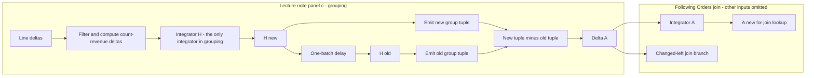
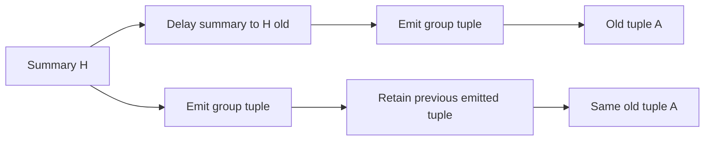
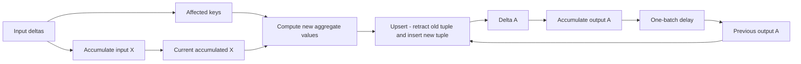

# Evidence for reconstructed accumulated state

## Storage differences from RocksDB

A **trace** is the runtime interface for reading and updating retained state. `Spine` is its concrete
implementation: a **spine** (LSM run collection and background merger) holds **batches** (immutable sorted
runs of weighted updates, in memory or files) and merges them in the background
([spine
description](https://github.com/feldera/feldera/blob/f3c06614f53b1c01e0f6b8745d690ad6a2bcac7c/crates/dbsp/src/trace/spine_async.rs#L1-L7)).
A **layer file** (Feldera's immutable file format for nested sorted groups) calls each nesting level a
**column** (storage level, not a SQL attribute). Each level has a tree whose leaves are data blocks and whose
interior nodes are index blocks ([file
layout](https://github.com/feldera/feldera/blob/f3c06614f53b1c01e0f6b8745d690ad6a2bcac7c/crates/dbsp/src/storage/file.rs#L3-L54)).
For an indexed weighted relation, the outer level contains search keys `K`; the inner level contains sorted
values `V` grouped under each key, with associated weights. One `K` can have many values, while each distinct
`(K,V)` has one consolidated weight. A whole SQL row can be one `V`. This is a nested representation of the
composite mapping `(K,V) → weight`, not secondary indexing of every SQL field.

The file-backed batch builder writes keys to level zero and values plus weights to level one, then finishes
one file-backed batch. Thus these trees belong to each immutable run, not to the entire LSM collection
([batch
construction](https://github.com/feldera/feldera/blob/f3c06614f53b1c01e0f6b8745d690ad6a2bcac7c/crates/dbsp/src/trace/ord/file/indexed_wset_batch.rs#L982-L1016)).
The outer level compares `K`. After selecting a fixed `K`, the inner level compares `V`; it does not
compare `K` again or order records by weight. Inner seeks use a target `V` within that group's sorted values.
For example, `(K=7,V=order_a)` precedes `(K=7,V=order_b)` according to the order-tuple comparator. When runs
are combined, equal `K` groups are matched and equal `V` values within them have their weights added.
Ordering by `V` does not create a global lookup by `V` across different `K` groups. A scan-only
consumer need not use that seek capability. The file-format goals explicitly distinguish seeking from
sequential access and discuss disabling value indexing when unnecessary; that goal alone does not establish
an implemented switch or a measured benefit
([access
goals](https://github.com/feldera/feldera/blob/f3c06614f53b1c01e0f6b8745d690ad6a2bcac7c/crates/dbsp/src/storage/file.rs#L30-L36)).

This differs from RocksDB's key-to-value interface: an indexed Feldera relation exposes sorted keys and
sorted weighted values within each key. RocksDB's ordinary writes enter a mutable memtable; Feldera's spine
accepts already built immutable batches. See the official
[RocksDB overview](https://github.com/facebook/rocksdb/wiki/RocksDB-Overview).

A **Z-set** (relation with signed tuple multiplicities) adds weights for identical complete tuples and omits zero totals
([read
consolidation](https://github.com/feldera/feldera/blob/f3c06614f53b1c01e0f6b8745d690ad6a2bcac7c/crates/dbsp/src/trace/cursor/cursor_list.rs#L150-L174)).
RocksDB's `Put`/`Delete` semantics differ, but its application-defined
[merge operator](https://github.com/facebook/rocksdb/wiki/Merge-Operator) can combine updates too.
The distinction is the collection contract, not an inability to express addition in RocksDB.

`VecIndexedWSet` (in-memory indexed weighted relation) contains keys, offsets, values, and signed weights
([memory
layout](https://github.com/feldera/feldera/blob/f3c06614f53b1c01e0f6b8745d690ad6a2bcac7c/crates/dbsp/src/trace/ord/vec/indexed_wset_batch.rs#L158-L199));
`FallbackIndexedWSet` (batch type choosing memory or file storage) selects memory or file
representation
([variants](https://github.com/feldera/feldera/blob/f3c06614f53b1c01e0f6b8745d690ad6a2bcac7c/crates/dbsp/src/trace/ord/fallback/indexed_wset.rs#L34-L58)).
The **root circuit** (top-level operator graph) has only one timestamp value, `()` in Rust, selecting a batch
without varying logical time ([timestamp
mapping](https://github.com/feldera/feldera/blob/f3c06614f53b1c01e0f6b8745d690ad6a2bcac7c/crates/dbsp/src/time.rs#L214-L219)).
File indexed batches implement asynchronous key fetching
([fetch](https://github.com/feldera/feldera/blob/f3c06614f53b1c01e0f6b8745d690ad6a2bcac7c/crates/dbsp/src/trace/ord/file/indexed_wset_batch.rs#L447-L478)),
which joins can use
([join fetch
path](https://github.com/feldera/feldera/blob/f3c06614f53b1c01e0f6b8745d690ad6a2bcac7c/crates/dbsp/src/operator/dynamic/join.rs#L1653-L1687)).
A comparison must record the actual fetch setting
and storage/cache configuration.

## Folded keys require flat KV storage

The chosen merged-index representation is `byte_key → encoded_value`, with one value per complete physical
key in each visible state. **Folding** (record-type-specific encoding of key fields into bytes) produces the
key. Customer, Orders, and extended Lineitem use different folding rules. Their logical positions `(c)`,
`(c,o)`, and `(c,o,l)` describe the intended order, not storage-visible columns. The storage layer compares
opaque byte strings; the access layer knows the encodings, constructs range bounds, and decodes record types.
Encoding must distinguish records and preserve the required cross-type order. Merely concatenating fields
or putting a type tag first is not a specified encoding.

This is a user-specified architectural requirement. Feldera's existing `K → {V → weight}` representation
remains the baseline for operator state; it is not the physical layout chosen for the merged index. An
operator requests a key or range; the adapter computes encoded bounds, seeks the KV cursor, and decodes
the required fields from the returned entries. The backend compares byte keys without maintaining a
separate index on each folded field.

The proposed Q3 scan keeps the current order identifier, required old/new parent payloads, and four running
scalars: old/new qualifying-line count and revenue. It advances through the order's encoded range and adds
each qualifying line's weighted contribution to those scalars. Once the range ends, it produces the old/new
state tuples required by the selected access, including parent fields when reconstructing a joined state.
The scan does not retain a vector or hash map of
all line tuples. Its summary state does not grow with line count; storage pages, decoding buffers, variable
payload sizes, and shared-consumer buffers still count toward the memory budget.

A consumer that requires individual line tuples receives them incrementally through a cursor. Computed
aggregate tuples are likewise cursor results; neither requires a complete reconstructed relation in memory.
An operator API that requires an immutable batch object must receive explicitly budgeted storage, including
spills if needed. The shared-session pseudocode below specifies ownership, ordering, and buffer pressure.

Reuse the same LSM machinery: the spine, immutable-run management, compaction scheduling, cache, and
snapshot ownership. Flat KV changes the records and their comparison/merge rules, not the need for that
machinery. `Spine` is generic over its batch type
([generic trace
implementation](https://github.com/feldera/feldera/blob/f3c06614f53b1c01e0f6b8745d690ad6a2bcac7c/crates/dbsp/src/trace/spine_async.rs#L2085-L2090));
the adapter must satisfy its batch contracts. This does not mean reusing `FileIndexedWSet` unchanged. The file layer
separates key data from auxiliary data, and documents typed comparisons
([file representation and
ordering](https://github.com/feldera/feldera/blob/f3c06614f53b1c01e0f6b8745d690ad6a2bcac7c/crates/dbsp/src/storage/file.rs#L3-L65)).
That provides a place to investigate a flat byte-key representation; it does not establish an existing
flat weighted-KV adapter. Select a byte-key type/comparator with the required lexicographic order and define
how batches, merging, reads, and snapshots preserve the encoded values.

Flat KV shape does not select update semantics. Values must preserve payloads, weights, and enough type
information for decoding. A payload replacement can retract and insert different complete tuples at the
same logical identity. The pending-update representation must retain those changes and the old snapshot;
it cannot sum their weights by folded identity alone and discard the payload difference. Exact version and
pending-record encoding remains implementation work. Complete-tuple weighted reconstruction, one visible
value per physical key, and consistent old/new views are required regardless of that choice.

## Shared scan sessions bound ownership and memory

A **scan session** owns one physical range cursor and the buffers used by its registered readers. A durable
index handle may be shared; mutable cursor position belongs to a session. This follows the supplied
[`mi_db` session design](../../../../mi_db/docs/architecture.md#merged-index-scan-sessions): register readers
before scanning, share one buffer per record type, and give same-type readers independent positions.
Its [buffer guard](../../../../mi_db/docs/architecture.md#pending-buffer-guard) warns at 80% and fails before
an insertion reaches its limit; it does not implement spill or reread. The pseudocode below is a proposed
Feldera adaptation with explicit overflow choices, not an implemented API or a claim about `mi_db` code.

The cited document is modified working-tree content inspected on 2026-09-28, based on `mi_db` revision
`d50d29dfe559258351c1071e59ca5365eacf09d0`. Its SHA-256 is
`d043b9b28121fe044980fde032d95e4b00c331e1d7a137ce709bd70eb6914e79`.

### Batch owner and view lifetime

A **view lease** is a reference that prevents releasing a batch's old/new source and parent-lookup views.
One owner stages the complete input update batch, including induced descendant rekeys, before opening any
new-view reader. Publishing these views to operators is distinct from committing externally visible results.
The runtime must report completion of all consumers, including output-state updates and work across steps.
Physical cursor EOF alone does not establish that completion.

```text
process_batch(input, consumer_plan):
    owner = begin_owner(input.batch_id, total_memory_budget)
    try:
        owner.old = pin_committed_source_and_parent_lookup()
        owner.pending = stage_all_changes(input, owner.old)   # includes descendant rekeys
        owner.new = seal_weighted_overlay(owner.old, owner.pending)
        owner.publish_to(consumer_plan)                       # views no longer change

        provider = ReconstructedStateProvider(owner)
        run_existing_ivm_paths(input.deltas, provider, consumer_plan)
        await consumer_plan.all_tasks_and_output_updates_finished()
        provider.close_all_sessions_and_sorted_cursors()
        assert owner.outstanding_view_leases == 0

        commit_source_lookup_and_output_progress(owner)       # required atomic commit boundary
    except failure:
        cancel_and_join_all_consumers()                       # no concurrent reader left
        close_all_cursors_and_release_returned_values()
        abort_or_recover_at_commit_boundary(owner)
        raise failure
    finally:
        owner.release_snapshot_references()
```

`seal_weighted_overlay` resolves complete-tuple signed updates; it must retain both payloads of a replacement
at an unchanged folded identity. The commit/abort calls state required backend/runtime behavior, not a new
WAL design. On a failure during commit, recovery must determine the committed endpoint before retry. Source
records, parent lookup, and output progress must not advance independently. Compaction can replace runs while
pinned snapshot references keep old reads valid.

### Requests retain the existing operator contract

A request identifies the accumulated relation, requested keys, old/new view, and required key/value order.
The provider derives bounds with the record-type codecs. Sharing is chosen when the consumer plan is prepared,
so every reader is registered before scanning. A session may scan a coalesced range and readers may filter
within it, but two arbitrary overlapping requests do not automatically share a mutable cursor.

```text
prepare_access(requests, owner):
    for group in choose_compatible_scan_groups(requests):
        session = ScanSession(
            view_lease = owner.acquire(group.view),
            range = encode_bounds(group.covered_keys),
            decode_fields = union_of_fields_needed_by_type(group),
            memory = owner.reserve_child_budget(group.buffer_limit))
        register_all_typed_readers(session, group)
        session.seal_registration()

        for request in group:
            state_cursor = reconstruct_requested_state(request, session.readers_for(request))
            if proves_required_order(state_cursor, request.key_and_value_comparator):
                publish_cursor(request, state_cursor)
            elif maintained_path_matches(request, owner):
                close_unused_readers(state_cursor)
                publish_cursor(request, open_versioned_access_path(request, owner))
            else:
                publish_cursor(request, external_sort_and_consolidate(
                    state_cursor, request.key_and_value_comparator,
                    owner.reserve_sort_budget(), account_all_temporary_io))
```

Compatibility includes batch/view identity, encoded range, decoder requirements, and forward traversal.
Independent views or ranges use independent sessions in this minimal design. Sharing one traversal across
old/new views requires an additional version-aware reader returning both weights and payloads; the lifecycle
above permits it but does not imply it is already implemented. Readers needing an independent seek close
and reopen their own access instead of repositioning a cursor under other consumers. Replayed reads are
charged. Existing operator seek/order behavior must still be honored.

External sorting writes bounded sorted runs and performs a bounded-fan-in merge. It orders by the requested
operator comparator and consolidates identical output tuples, preserving weights and dropping zero totals.
A maintained access path must expose the same batch view and include its maintenance cost. Merely decoding
byte keys proves neither operator order nor consolidation. These choices happen inside state access;
value-difference and retraction/insertion logic stays in the existing IVM operators.

### Shared typed buffers and reader positions

A **typed buffer** is a sequence of decoded records of one type, shared by all readers requesting that type.
The session stores `{physical_cursor, range, view_lease, buffers_by_type, readers, eof, memory_account}`.
A reader starts with `{type, next_sequence=0, outstanding_lease=empty, closed=false}`. Sequence numbers
are absolute and remain valid after reclaiming prefixes. The scheduler serializes `next`, `release`, and
`close` for one session; its physical cursor and buffer registry must not be mutated concurrently. A wait
yields control without holding a lock that prevents another reader from progressing. Decoder projections
are fixed before scanning; a record is decoded once to the union of required fields for that type.
Predicates and relational reconstruction are outside this
physical record distribution step, as in the
[`mi_db` typed-buffer design](../../../../mi_db/docs/architecture.md#shared-typed-buffers).

```text
next(reader):
    require not reader.closed and reader.outstanding_lease is empty
    loop:
        buffer = session.buffers[reader.type]
        if buffer.contains(reader.next_sequence):
            lease = buffer.borrow_with_budgeted_reload(reader.next_sequence)
            if lease is WAIT or RESOURCE_LIMIT: return lease
            reader.outstanding_lease = lease
            return lease
        if session.eof:
            return EOF                                      # this reader has drained its suffix

        record = session.physical_cursor.peek_bounded()      # cursor page is budgeted
        if record == EOF:
            session.eof = true
            continue
        if no_active_reader(record.type):
            session.physical_cursor.advance()
            continue

        needed = bounded_decode_size(record) + queue_metadata_cost
        if not session.memory.try_reserve(needed):
            return handle_pressure_without_advancing_cursor(record, needed)
        decoded = decode_registered_fields(record)           # allocation covered by reservation
        session.buffers[record.type].append(decoded)
        session.physical_cursor.advance()

release(reader):
    require reader.outstanding_lease exists
    reader.outstanding_lease = empty
    reader.next_sequence += 1
    reclaim(reader.type)

reclaim(type):
    live = active_readers_of(type)
    cut = min(r.next_sequence for r in live) if live else buffers[type].end_sequence
    buffers[type].release_entries_before(cut)                # releases byte reservations too

close(reader):
    if reader.closed: return
    require reader.outstanding_lease is empty
    reader.closed = true
    remove_reader_from_registry(reader)
    reclaim(reader.type)
    if no_active_readers(): close_physical_cursor_and_release_view_lease()
```

The caller releases each borrowed record before requesting another. Holding a field beyond release requires
a copy charged to the consumer's budget. Closing is idempotent and requires releasing outstanding borrows
first. Batch cancellation stops all consumers before cleanup; session shutdown cannot leave borrowed pointers
into reclaimed storage. Reloading a spilled entry reserves memory before reading; it can yield or fail
rather than exceed the budget. Physical EOF
still permits every reader to drain buffered records. For two Lineitem readers starting at sequence zero,
reader A consuming records 0–9 does not free them while B remains at zero. After B releases record 0, that
record can be reclaimed. Closing B lets A's consumed prefix be reclaimed immediately. Other record types
have separate buffers and positions but compete for the same session byte limit.

### Overflow must have a progress path

Charge unique decoded records once, plus allocated capacity, queue metadata, reader positions, and in-flight
decode storage. Budget reservations precede allocation; a record larger than the entire budget requires a
streamed/spilled representation or an explicit error. A size estimate must be conservative and enforced.
Per-session limits are suballocations of a total budget also covering storage cache, operator state, sort
runs, pending updates, and consumer copies. Spilling does not make its indexing metadata free.

```text
handle_pressure_without_advancing_cursor(record, needed):
    reclaim_all_consumed_prefixes()
    if room_for(needed): return RETRY
    if scheduler_can_run_a_reader_that_will_release_space():
        wake_that_reader()
        return WAIT_FOR_RELEASE                             # yield; do not block its thread
    if configured_policy == SPILL:
        spill_unborrowed_unread_entries_preserving_sequences()
        return RETRY if room_for(needed) else RESOURCE_LIMIT
    if configured_policy == REREAD:
        detach_lagging_reader_to_independent_pinned_view_scan()
        return RETRY if room_for(needed) else RESOURCE_LIMIT
    return RESOURCE_LIMIT
```

`RETRY` and `WAIT_FOR_RELEASE` are internal scheduler results, not tuples returned to the operator. The
runtime adapter resumes the same request. Spilled entries keep their sequence identities, and later reads
load them through budgeted buffers; borrowed entries remain pinned. A reread uses the same immutable view
and exact continuation token, including position within a decoded version if one physical key yields several
records. It must neither duplicate nor skip a record and must reserve its own cursor memory before detaching.
If a continuation cannot be represented safely, reject that fallback rather than guessing a seek key.

Backpressure alone cannot resolve a dependency cycle: the reader that pins data might be waiting for the
reader currently requesting more. The scheduler must establish a runnable consumer that can free space;
otherwise spill, reread, or fail the batch explicitly. Never drop required rows, silently enlarge the budget,
or spin on `RETRY` without progress. Spill/reread are proposed extensions to the cited `mi_db` guard.

Conformance checks should interleave same-type and different-type readers, drain buffered suffixes after
physical EOF, close lagging readers, and hold borrowed values during pressure. Also test registration after
sealing, independent seeks, cross-step view lifetime, oversized records, dependency cycles, external-order
changes, and failure during commit. Compare both state-provider results and the shared IVM output with the
retained-state baseline; report high-water bytes and every spill, reread, sort, and access-path write.

## Merged index reconstructs integrator outputs

An **integrator** accumulates its input deltas into output state. The merged index replaces access to that
accumulated output; it does not reconstruct the integrator's input delta stream. Downstream IVM computation
continues to receive deltas through the existing path and requests accumulated state through the provider.

The lecture note [Maintaining a Query, One Change at a Time](../../../../DBSP_w_merged_index/dbsp-merged-index-feasibility.tex#L276)
contains “Equivalent Q3 circuits” (Figure 4). Its panel (c) and Feldera's generic aggregate show different
implementations of the same grouping semantics. **The lecture note's panel (c) has one integrator inside
grouping**, for Count/Revenue state. The figure names that
state `M`; this note calls it `H`. A **delay** (`z^-1`, the previous batch's value) supplies `H_old`, from which
the old aggregate tuple is computed. The delay retains information but is not a second integrator.
The `A` integrator appears in the subsequent Orders join. See the
[actual figure source](../../../../DBSP_w_merged_index/figures/q3-dbsp-circuit.tex#L59) and
[five-integrator explanation](../../../../DBSP_w_merged_index/dbsp-merged-index-feasibility.tex#L405).



For an order changing from count/revenue `(2,100)` to `(3,130)`, the grouping's two emit functions produce
`(order,100)` and `(order,130)`. Subtraction produces `-[[order,100]] + [[order,130]]`. No retained aggregate-output
collection is necessary inside this grouping: `H_old` already contains the information needed to compute
the old tuple. The following join integrates `Delta A` because it needs accumulated `A` when Orders changes.
The five integrators remain `H`, `A`, eligible Orders, `B`, and eligible Customers; no sixth one is implied.

Retaining the prior aggregate tuple serves the same old-state role as the delay in the lecture note's panel (c). The precise
objects differ: the figure delays the summary `H`, whereas output retention preserves the emitted tuple
`A = E(H)`. For the fixed, pointwise group-emission function `E`, moving the delay across `E` preserves the
value:

```text
E(H[t-1]) = (z^-1 E(H))[t] = A[t-1]
```

This follows directly from the definition of a one-batch delay. It does not require a new integrator or a
separate durable output copy in the merged-index design. It requires access to the correct preceding state,
including group absence. The two following old-value paths are equivalent:



Timed weighted source tuples can satisfy either read. With `tau` denoting the input-batch version, resolve
complete-tuple weights at the requested version before grouping:

```text
weight_at(tuple, t) = sum(change.weight for change of that complete tuple with change.time <= t)
H_at(k, t) = sum(weight_at(line, t) * (1, revenue(line))
                 for qualifying line tuples in order k at version t)
A_at(k, t) = {(k, H_at(k,t).revenue) -> 1} if H_at(k,t).count > 0 else empty
old_tuple = A_at(k, t-1)
new_tuple = A_at(k, t)
```

This is the versioned-read contract, not a requirement to scan all historical changes on every access.
Pinned runs, consolidated versions, and range cursors implement it. Source batch versions here are distinct
from the unit timestamp of Feldera's root computation. Payload replacements and rekeys must retain enough
information to resolve the complete tuples and parent lookup at both requested versions; compaction cannot
discard information still needed by an old-view reader. A negative weight alone does not identify which
batch it belongs to. Given the version and weighted payloads, the provider can reconstruct the delayed state
without separately storing the old aggregate tuple.

Feldera's generic aggregate makes a different computation/storage tradeoff. It computes new group values
from an accumulated input collection `X` and retrieves the old aggregate tuple from accumulated output `A`.
Here `X` means whatever indexed collection that generic operator receives; it is not necessarily the raw
Lineitem relation or the `H` in the lecture note's panel (c). The source lists recomputing old values as an
alternative, but selects output retention
([aggregate construction](https://github.com/feldera/feldera/blob/f3c06614f53b1c01e0f6b8745d690ad6a2bcac7c/crates/dbsp/src/operator/dynamic/aggregate.rs#L452-L499),
[design rationale](https://github.com/feldera/feldera/blob/f3c06614f53b1c01e0f6b8745d690ad6a2bcac7c/crates/dbsp/src/operator/dynamic/aggregate.rs#L766-L796)).



`Upsert` here converts per-key replacement values into weighted tuple changes. Its source explicitly draws
the output integrator and delayed feedback
([output-state wiring](https://github.com/feldera/feldera/blob/f3c06614f53b1c01e0f6b8745d690ad6a2bcac7c/crates/dbsp/src/operator/dynamic/upsert.rs#L90-L109)).
This diagram explains the runtime comment about two accumulated collections. Its old-output feedback serves
the same semantic role as delaying and emitting the summary in the lecture note's panel (c). The different wiring is a choice
of where to retain versus recompute information; it does not impose another physical copy on the merged index.

For the chosen lecture-note circuit, the merged-index provider supplies `H_old`/`H_new` to the existing group-tuple
emitters and separately supplies accumulated `A` to the Orders join. It does not add an output integrator
inside grouping. If adapting the generic runtime path instead, the provider must satisfy that path's `X`
and previous-`A` state requests. Select bindings for the actual circuit rather than combining the state
inventories of these two implementations. In either case, input delta streams remain unchanged.

The provider boundary is a request for an accumulated relation, keys, and old/new view. Its result must match
ordinary retained-state access, including tuple values, multiplicities, group absence, ordering, and cursor
behavior. Reconstruction can compute a summary or a prior output tuple to satisfy that request; it does not
introduce another aggregate delta-emission algorithm. Both providers feed the same operator path.

For example, if an existing additive-summary algorithm expects a value difference, a revenue change from
100 to 110 produces a difference of 10 in that summary's value. If the algorithm replaces a relation tuple,
it emits `-[[order,100]] + [[order,110]]`, where `[[t]]` means one copy of tuple `t`. These are different
output contracts, not interchangeable wire formats: 10 is a revenue difference, whereas -1 and +1 are tuple
multiplicities. Existing operator code chooses and computes the required form using its deltas and state
accesses. The merged-index provider supplies the same requested state for either form. It must also preserve
group existence when count changes, even if revenue does not.

Register a computation routine for each required integrator output. For Q3, one routine scans weighted
qualifying lines to derive Count/Revenue state `H`; another computes the group relation `A`, including its
weight-one row or absence; another derives `B` using order payloads. Eligible Orders and Customers have their
own routines. All derive requested accumulated state from source records in the specified old/new view.
They do not regenerate operator input deltas or feed full reconstructed snapshots into incremental inputs.

```text
reconstructors = {
    H: compute_count_and_revenue_state,
    A: compute_aggregate_relation,
    O: derive_eligible_orders,
    B: derive_aggregate_orders_relation,
    C: derive_eligible_customers
}

provider.open(integrator_id, requested_keys, view):
    compute = reconstructors[integrator_id]
    source_access = scan_owner.access(requested_keys, view)
    return compute(source_access)          # same accumulated output as that integrator

# Existing IVM path:
# receive the existing input delta stream, unchanged
# request the required integrator outputs and old/new views through provider.open
# compute and emit changes using the existing operator algorithm
```

Each routine has its own computation algorithm. It can directly derive its requested state from merged
source ranges instead of consuming an earlier materialized reconstruction. Routines may share decoded
records or budgeted per-group summaries when keys and views agree. For example, deriving `A` can reuse the
count/revenue scalars needed for `H`, but there is no requirement to materialize `H` or run its consumer first.
Deriving `B` can use the same scan and parent payload. Shared reads are an optimization; the returned state
must be identical with or without them.

Bind routines to the state accesses present in the chosen circuit. The lecture note's grouping requests summaries;
its Orders join requests accumulated `A`. A generic runtime path that reads previous output can request it
from an `A` reconstruction routine at the preceding version, equivalently emitting the reconstructed old `H`.
These are different consumers of reconstructible state, not a requirement
to add every illustrated state object to the chosen circuit. Concrete runtime bindings remain implementation
work; only accumulated-state access changes, while delta processing remains in the shared IVM path.

Delayed views and join-side accesses obey the same rule. Existing join wiring uses left delta/current right
and right delta/delayed left ([join
construction](https://github.com/feldera/feldera/blob/f3c06614f53b1c01e0f6b8745d690ad6a2bcac7c/crates/dbsp/src/operator/dynamic/join.rs#L698-L749));
separate reconstruction routines must honor the requested view rather than choosing one themselves.

## Weighted reconstruction preserves group existence

For each requested relation `T` and key set `K`, require
`reconstruct(T, source_s, K) = T(database_s) restricted to K`, including payloads, weights, and group existence.
The supplied note identifies the five logical **integrators** (operators accumulating changes into current state)
([five accumulations](../../../../DBSP_w_merged_index/dbsp-merged-index-feasibility.tex#L405)) and their
weighted reconstruction ([definitions](../../../../DBSP_w_merged_index/dbsp-merged-index-feasibility.tex#L508)).

```text
N_s(k) = sum_l w_s(l) * [qualifying(l)]
R_s(k) = sum_l w_s(l) * [qualifying(l)] * rho(l)
A_s    = { (k, R_s(k)) -> 1 | N_s(k) > 0 }
deltaA = A_new - A_old
delta(L join R) = deltaL join R_new + L_old join deltaR
```

`N_s(k)` and `R_s(k)` answer different questions: does the group exist, and what is its revenue? In this
scope, complete endpoint states have nonnegative tuple multiplicities, so `N>0` means at least one qualifying
line remains. Signed input changes are first applied to obtain that state.

| Qualifying line state for key `k` | `N` | `R` | Required group relation |
| --- | --- | --- | --- |
| No lines | 0 | 0 | Absent |
| One line with zero revenue | 1 | 0 | `(k,0)` at weight 1 |
| Two lines with revenues 60 and 40 | 2 | 100 | `(k,100)` at weight 1 |

Deleting the sole zero-revenue line changes `(N,R)` from `(1,0)` to `(0,0)`. The revenue difference is zero,
but the aggregate relation must emit `-[[k,0]]`. A revenue-only summary would miss this deletion. This is
grouped aggregation: an empty group emits no tuple. The count is not an extra query output column.

When reconstructing only `A` by a full range scan, detecting any surviving qualifying line is sufficient for
group existence; the provider need not separately persist a count. When supplying the requested summary `H`,
it must return both `N` and `R` to match the existing integrator contract. Count is useful in an additive
summary because insertion/deletion weights update it directly; a stored presence bit alone cannot tell
whether deleting one line removes the last of several lines. Revenue could determine presence only under an
additional strict-positivity guarantee, which this note does not assume.

A generalized line bag of weight three contributes three times its revenue;
retracting one copy changes its weight to two. This illustrates weighted reconstruction, not SQL equivalence
of the aggregation-first rewrite with duplicate parent rows. That equivalence assumes valid primary/foreign
keys and unit-weight parents ([query
assumptions](../../../../DBSP_w_merged_index/dbsp-merged-index-feasibility.tex#L177)).
The count/existence requirement also appears in the
[operator-state guide](../../../../DBSP_w_merged_index/operator-state.tex#L39).

The main note's replacement has two distinct complete line tuples at weights `-1` and `+1`. Their key weights
sum to zero, but their **support** (tuples with nonzero weight) still marks the order as affected. Identical
complete-tuple changes that cancel
can be discarded. Changed customers expand to descendant orders in either endpoint; **rekeys** (moves to changed
physical key prefixes) include both
prefixes ([affected-key derivation](../../../../DBSP_w_merged_index/dbsp-merged-index-feasibility.tex#L564)).

## Immutable batches preserve old reads

`SpineSnapshot` (read view retaining a fixed set of immutable runs) owns reference-counted batches and supports
constructing a view with additional batches
([snapshot ownership and
composition](https://github.com/feldera/feldera/blob/f3c06614f53b1c01e0f6b8745d690ad6a2bcac7c/crates/dbsp/src/trace/spine_async/snapshot.rs#L56-L153)).
Combined cursors add matching
weights and suppress zero totals
([consolidation](https://github.com/feldera/feldera/blob/f3c06614f53b1c01e0f6b8745d690ad6a2bcac7c/crates/dbsp/src/trace/cursor/cursor_list.rs#L150-L174)).
These establish existing weighted-batch primitives. The flat KV adapter must implement equivalent old/new
visibility for encoded payloads; concatenating batches or overwriting equal byte keys is not by itself proof
of correct weighted reconstruction. Reads must resolve the pending changes without waiting for compaction.

The integration must keep the old source snapshot and parent lookup alive, stage complete payload retractions
and descendant rekeys, then **seal** the pending updates
(make the complete set immutable and readable) for a consistent new view. Retire old ownership only when every consumer
has
finished. Runtime transactions can span multiple steps, so cursor exhaustion or one step is not the barrier
([transaction
scheduling](https://github.com/feldera/feldera/blob/f3c06614f53b1c01e0f6b8745d690ad6a2bcac7c/crates/dbsp/src/circuit/schedule.rs#L186-L226),
[commit
flushing](https://github.com/feldera/feldera/blob/f3c06614f53b1c01e0f6b8745d690ad6a2bcac7c/crates/dbsp/src/circuit/circuit_builder.rs#L7777-L7805)).

These primitives support the design but do not establish atomic publication or restart of the new shared
index. Implementation must coordinate source batches, native-order lookup, and output progress so recovery
exposes a complete endpoint and retry does not apply weights twice. Snapshot retention also has a memory and
storage cost. A per-record phase bit is not an architectural requirement; the flat KV adapter must specify its version
retention and pending-update representation.

## Consumers determine the required payload

Q5's selected Customer–Orders–Lineitem expression consumes an external Nation/Region **gate** (eligibility filter) and
preserves
supplier identifiers for later matching. A changing gate needs consistent old/new multiplicities and an
expansion to affected customers; a boolean gate suffices only under the key assumptions
([Q5 consumer and
gate](https://github.com/alicia-lyu/leanstore/blob/305ad0a98b147d048a37a1eba3787b35b1181b85/frontend/tpch/q5/query.tpp#L219-L335)).

Q10's selected expression produces returned-line join rows and full required customer payloads. Customer
aggregation and Nation-name attachment remain downstream; a per-order revenue-only record cannot replace
those join rows ([Q10 logical
plan](https://github.com/alicia-lyu/leanstore/blob/305ad0a98b147d048a37a1eba3787b35b1181b85/frontend/tpch/q10/plans/family_logical.dot#L34-L69),
[customer output
consumption](https://github.com/alicia-lyu/leanstore/blob/305ad0a98b147d048a37a1eba3787b35b1181b85/frontend/tpch/q10_family/visitor.hpp#L126-L200)).
These are analytical boundary checks, not
executed Feldera reconstruction experiments. Any comparison must match actual date endpoints: the inspected
implementations use day offsets ([Q5
bounds](https://github.com/alicia-lyu/leanstore/blob/305ad0a98b147d048a37a1eba3787b35b1181b85/frontend/tpch/q5/query.tpp#L307-L315),
[Q10
bounds](https://github.com/alicia-lyu/leanstore/blob/305ad0a98b147d048a37a1eba3787b35b1181b85/frontend/tpch/q10/query.tpp#L100-L107)),
which need not equal calendar intervals.

## Refresh reads can serve reconstruction

Existing **RF2** (TPC-H order-and-lines deletion refresh) discovery looks up the order's customer and scans native
Lineitem for line numbers
([discovery](https://github.com/alicia-lyu/leanstore/blob/305ad0a98b147d048a37a1eba3787b35b1181b85/frontend/tpch/tpch_family/refresh.hpp#L143-L178));
**COL** (Customer–Orders–Lineitem index) helpers perform direct insertions and erasures
([maintenance](https://github.com/alicia-lyu/leanstore/blob/305ad0a98b147d048a37a1eba3787b35b1181b85/frontend/tpch/tpch_family/col_pipeline.tpp#L150-L220)).
These demonstrate the access paths, not old-payload
retention or shared incremental reads. The proposed scanner must retain full required payloads, distribute
them to consumers, and charge any repeated pass. **RF1** (TPC-H order-and-lines insertion refresh) requires verified
freshness for its new-key shortcut.

The merged-index interesting-orderings manuscript's refresh experiment describes order-group insertion/deletion
([workload](../../../../merged_index_interesting_orderings/sections/experiments_revised.tex#L173)). Its LSM
variant matches **Base-Merge** (that manuscript's baseline merge-join plan) rather than leading in that experiment
([backend comparison](../../../../merged_index_interesting_orderings/sections/experiments_revised.tex#L229)).
That result does not predict a benefit for Feldera; storage backend and total maintenance work matter.

## Evidence and measurements bound the claim

The source links pin Feldera at `f3c06614f53b1c01e0f6b8745d690ad6a2bcac7c` and LeanStore at
`305ad0a98b147d048a37a1eba3787b35b1181b85`. Local manuscript/checker links assume sibling checkouts under the
same parent as Feldera; their `#L` fragments are source-viewer line locators. The DBSP note and checkers are at
`ac8380511fe4463b81651a3f6d6991b849577ff7`; the cited files are clean. The interesting-orderings manuscript's
cited experiment file is clean at `6c4c3a5d851c9044352da2aead6b419c45c77237`. Unrelated working-tree manuscript
changes are not evidence here.

Run the supplied models from the repository root:

```sh
python3 ../DBSP_w_merged_index/validation/check_q3.py
python3 ../DBSP_w_merged_index/validation/check_operators.py
```

The Q3 suite has 12 test methods and the operator suite 8, including weighted changes, simultaneous changes,
group existence, rekeys, and sequential updates
([Q3 tests](../../../../DBSP_w_merged_index/validation/check_q3.py#L391)). Passing them demonstrates model
semantics. They do not execute this access-layer design, recovery, Q5/Q10 reconstruction, or physical I/O.

| Acceptance question | Required evidence |
| --- | --- |
| Are operator inputs and results identical? | Run the same operator path with retained and reconstructed state providers; compare requested tuples, weights, ordering, absence, and old/new views, then check value-difference or retraction/insertion outputs against independent evaluation. |
| Does the flat KV adapter preserve encoding and weighted updates? | Verify cross-type byte ordering, exact range bounds, type decoding, payload replacements at unchanged keys, signed multiplicities, and old/new visibility. |
| Does shared access preserve lifecycle and memory bounds? | Interleave consumers, exceed the buffer budget, and exercise abort/restart; verify old payload retention, consistent lookup publication, and exactly-once batch advancement. |
| Does storage replacement actually occur? | Inventory retained state, including aggregate output and delays; confirm intermediate snapshots are not accumulated again. |
| Is total maintenance cheaper? | Compare beyond-memory runs under equal total memory and comparable durability, with matched predicates/results and baseline fetch enabled where configured. |

For equal-sized blocks, `unique footprint = block_bytes * size(union of all consumers' blocks)`.
Actual read traffic is the sum of physical read events; eviction can cause repeat reads. Include RF1/RF2,
parent lookup, all operator access, staging, merging, checkpointing, and spills in measured reads/writes.
Report persistent and peak storage, CPU/decoding, memory high-water, fan-out, and complete-batch latency for
clustered and scattered updates. Neither fewer unique blocks nor a resident scan speedup proves lower total
maintenance I/O.
