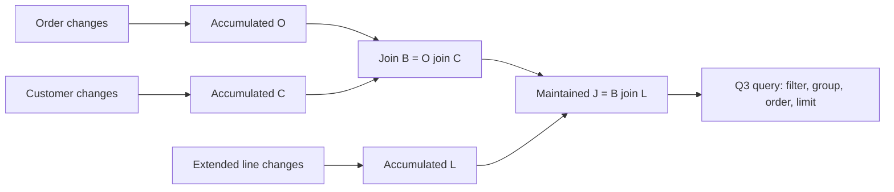

# Evidence for reconstructed accumulated state

## Storage differences from RocksDB

> [!NOTE]
> **Glossary**
>
> **Retained state** — An integrator's accumulated output stored and maintained across input updates.
> Reads obtain its tuples from that maintained collection, which may reside in memory or files.
>
> **Reconstructed state** — The same integrator output computed for requested keys and a before/after view
> from stored weighted source records, instead of maintaining that output as a separate collection.
>
> Both supply the same tuples, weights, group presence/absence, and cursor ordering to the existing IVM
> path. Neither term refers to reconstructing input deltas. Reconstructed state still depends on retained
> source data and may use bounded temporary buffers; the distinction is how the integrator output is supplied.
>
> **spine** — collection of immutable batches and background merger.
>
> **batches** — immutable sorted collections of weighted updates, in memory or files.
>
> **layer file** — Feldera's immutable file format for nested sorted groups.
>
> **column** — storage level, not a SQL attribute.
>
> **Trace** — The runtime interface for reading and updating retained state.

The **trace** interface exposes retained state. `Spine` is its concrete
implementation: a **spine** holds **batches** and merges them in the background
([spine
description](https://github.com/feldera/feldera/blob/f3c06614f53b1c01e0f6b8745d690ad6a2bcac7c/crates/dbsp/src/trace/spine_async.rs#L1-L7)).
A **layer file** calls each nesting level a
**column**. Each level has a tree whose leaves are data blocks and whose
interior nodes are index blocks ([file
layout](https://github.com/feldera/feldera/blob/f3c06614f53b1c01e0f6b8745d690ad6a2bcac7c/crates/dbsp/src/storage/file.rs#L3-L54)).
For an indexed weighted relation, the outer level contains search keys `K`; the inner level contains sorted
values `V` grouped under each key, with associated weights. One `K` can have many values, while each distinct
`(K,V)` has one consolidated weight. A whole SQL row can be one `V`. This is a nested representation of the
composite mapping `(K,V) → weight`, not secondary indexing of every SQL field.

The file-backed batch builder writes keys to level zero and values plus weights to level one, then finishes
one file-backed batch. Thus these trees belong to each immutable batch, not to the entire LSM collection
([batch
construction](https://github.com/feldera/feldera/blob/f3c06614f53b1c01e0f6b8745d690ad6a2bcac7c/crates/dbsp/src/trace/ord/file/indexed_wset_batch.rs#L982-L1016)).
The outer level compares `K`. After selecting a fixed `K`, the inner level compares `V`; it does not
compare `K` again or order records by weight. Inner seeks use a target `V` within that group's sorted values.
For example, `(K=7,V=order_a)` precedes `(K=7,V=order_b)` according to the order-tuple comparator. When batches
are combined, equal `K` groups are matched and equal `V` values within them have their weights added.
Ordering by `V` does not create a global lookup by `V` across different `K` groups. A scan-only
consumer need not use that seek capability. The file-format goals explicitly distinguish seeking from
sequential access and discuss disabling value indexing when unnecessary; that goal alone does not establish
an implemented switch or a measured benefit
([access
goals](https://github.com/feldera/feldera/blob/f3c06614f53b1c01e0f6b8745d690ad6a2bcac7c/crates/dbsp/src/storage/file.rs#L30-L36)).

This differs from RocksDB's key-to-value interface: an indexed Feldera relation exposes sorted keys and
sorted weighted values within each key. RocksDB's ordinary writes enter a mutable memtable; Feldera's spine
accepts already built immutable batches. See the official
[RocksDB overview](https://github.com/facebook/rocksdb/wiki/RocksDB-Overview).

> [!NOTE]
> **Glossary**
>
> **Z-set** — relation with signed tuple multiplicities.

A **Z-set** adds weights for identical complete tuples and omits zero totals
([read
consolidation](https://github.com/feldera/feldera/blob/f3c06614f53b1c01e0f6b8745d690ad6a2bcac7c/crates/dbsp/src/trace/cursor/cursor_list.rs#L150-L174)).
RocksDB's `Put`/`Delete` semantics differ, but its application-defined
[merge operator](https://github.com/facebook/rocksdb/wiki/Merge-Operator) can combine updates too.
The distinction is the collection contract, not an inability to express addition in RocksDB.

> [!NOTE]
> **Glossary**
>
> **root circuit** — top-level operator graph.
>
> **`VecIndexedWSet`** — An in-memory indexed weighted relation.
>
> **`FallbackIndexedWSet`** — A batch type choosing memory or file storage.

`VecIndexedWSet` contains keys, offsets, values, and signed weights
([memory
layout](https://github.com/feldera/feldera/blob/f3c06614f53b1c01e0f6b8745d690ad6a2bcac7c/crates/dbsp/src/trace/ord/vec/indexed_wset_batch.rs#L158-L199));
`FallbackIndexedWSet` selects memory or file
representation
([variants](https://github.com/feldera/feldera/blob/f3c06614f53b1c01e0f6b8745d690ad6a2bcac7c/crates/dbsp/src/trace/ord/fallback/indexed_wset.rs#L34-L58)).
The **root circuit** has only one timestamp value, `()` in Rust, selecting a batch
without varying logical time ([timestamp
mapping](https://github.com/feldera/feldera/blob/f3c06614f53b1c01e0f6b8745d690ad6a2bcac7c/crates/dbsp/src/time.rs#L214-L219)).
File indexed batches implement asynchronous key fetching
([fetch](https://github.com/feldera/feldera/blob/f3c06614f53b1c01e0f6b8745d690ad6a2bcac7c/crates/dbsp/src/trace/ord/file/indexed_wset_batch.rs#L447-L478)),
which joins can use
([join fetch
path](https://github.com/feldera/feldera/blob/f3c06614f53b1c01e0f6b8745d690ad6a2bcac7c/crates/dbsp/src/operator/dynamic/join.rs#L1653-L1687)).
A comparison must record the actual fetch setting
and storage/cache configuration.

## Trace access traverses keys then weighted values

> [!NOTE]
> **Glossary**
>
> **`BatchReader`** — Feldera's read interface for an ordered weighted collection.
>
> **`Cursor`** — A movable read position with separate key and value navigation and seek operations.
>
> **`WithSnapshot`** — The interface for obtaining a stable, read-only view of current trace contents.

`Trace` extends `BatchReader` with insertion of immutable update batches. Snapshot creation is a separate
interface implemented by the spine. The following is a deliberately reduced pseudocode view of these APIs
for root-circuit state (`Time = ()`); it omits factories, persistence, reverse navigation, and other methods.
`insert` appends signed updates, not replacement snapshots. Sources:
[`Trace` and insertion](https://github.com/feldera/feldera/blob/f3c06614f53b1c01e0f6b8745d690ad6a2bcac7c/crates/dbsp/src/trace.rs#L231-L308),
[`BatchReader`](https://github.com/feldera/feldera/blob/f3c06614f53b1c01e0f6b8745d690ad6a2bcac7c/crates/dbsp/src/trace.rs#L468-L496),
[`WithSnapshot`](https://github.com/feldera/feldera/blob/f3c06614f53b1c01e0f6b8745d690ad6a2bcac7c/crates/dbsp/src/trace/spine_async/snapshot.rs#L23-L43).

```text
interface BatchReader<K, V, R>:
    cursor() -> Cursor<K, V, R>                 # starts at first key and its first value

interface Trace<K, V, R> extends BatchReader<K, V, R>:
    async insert(batch: ImmutableWeightedBatch<K, V, R>)

interface WithSnapshot<K, V, R>:
    ro_snapshot() -> Snapshot<K, V, R>          # snapshot implements BatchReader

interface Cursor<K, V, R>:
    key_valid() -> bool
    val_valid() -> bool
    key() -> borrowed K                        # requires valid key
    val() -> borrowed V                        # requires valid key and value
    weight() -> borrowed R                     # consolidated weight of current (K,V)
    step_key()                                # next K; reset V to first value of that K
    step_val()                                # next V within current K only
    seek_key(target: K)                        # forward lower-bound seek by K
    seek_val(target: V)                        # forward lower-bound seek within current K
    rewind_keys()                             # restart at first K and first V
```

`K → {V → weight}` describes the contents exposed by those methods, not a required nested map allocation.
For example, one memory batch can represent this content with sorted arrays and offsets into the values:

```text
Exposed content:                  One memory-batch layout:
7 -> { order_a -> 1,              keys    = [7, 9]
       order_b -> 2 }            offsets = [0, 2, 3]
9 -> { order_c -> 1 }             values  = [order_a, order_b, order_c]
                                 weights = [      1,       2,       1]

For keys[i], its values occupy [offsets[i], offsets[i+1]).
At key index i and value index j:
    key()    = keys[i]
    val()    = values[j]
    weight() = weights[j]
```

This is the structure of the existing
[memory batch](https://github.com/feldera/feldera/blob/f3c06614f53b1c01e0f6b8745d690ad6a2bcac7c/crates/dbsp/src/trace/ord/vec/indexed_wset_batch.rs#L158-L199).
A file batch instead locates the key and its value group through file indexes and block reads. Both expose
cursor navigation; the consumer does not unpack the entire group into another container.

A snapshot can contain several batches. Its cursor combines their ordered contents: for matching `(K,V)` pairs,
sum the weights and omit zero totals; omit a key if all its values cancel. For example, appending updates
`((7,order_a),-1)`, `((7,order_d),+1)`, and `((9,order_c),-1)` to the batch above leaves
`7 → {order_b → 2, order_d → 1}`. The old snapshot still exposes the original contents. The running merge
keeps cursor positions in its member batches; it does not need to materialize the entire accumulated relation.
See [snapshot cursor construction](https://github.com/feldera/feldera/blob/f3c06614f53b1c01e0f6b8745d690ad6a2bcac7c/crates/dbsp/src/trace/spine_async/snapshot.rs#L196-L215)
and [weight consolidation and zero suppression](https://github.com/feldera/feldera/blob/f3c06614f53b1c01e0f6b8745d690ad6a2bcac7c/crates/dbsp/src/trace/cursor/cursor_list.rs#L150-L174).

The following traversal unpacks the exposed groups into weighted tuples one at a time. A weight of two stays
one weighted tuple; the consumer does not have to expand it into two copies.

```text
with trace.ro_snapshot() as snapshot:
    cursor = snapshot.cursor()
    while cursor.key_valid():
        while cursor.val_valid():
            consume(cursor.key(), cursor.val(), cursor.weight())
            cursor.step_val()
        cursor.step_key()

# Lookup instead of a full traversal:
with trace.ro_snapshot() as snapshot:
    cursor = snapshot.cursor()
    cursor.seek_key(requested_key)
    if cursor.key_valid() and cursor.key() == requested_key:
        while cursor.val_valid():
            consume(cursor.key(), cursor.val(), cursor.weight())
            cursor.step_val()
    # A lower-bound seek may land on a larger key: that means the requested key is absent.
```

`step_val()` never advances into the next key. `seek_val(v)` compares values inside the selected group;
it cannot locate `v` globally across keys. Forward seeks do not rewind a cursor already beyond their target;
use a fresh or rewound cursor for an earlier key. Borrowed fields must be consumed before movement, or copied
into explicitly budgeted storage. The snapshot remains alive until its readers finish. These semantics follow
the [cursor navigation contract](https://github.com/feldera/feldera/blob/f3c06614f53b1c01e0f6b8745d690ad6a2bcac7c/crates/dbsp/src/trace/cursor.rs#L42-L109)
and [seek methods](https://github.com/feldera/feldera/blob/f3c06614f53b1c01e0f6b8745d690ad6a2bcac7c/crates/dbsp/src/trace/cursor.rs#L197-L245).

With non-unit runtime timestamps the underlying shape is `K → V → (time, weight)` entries; one scalar weight
requires choosing which times to combine. Feldera provides `map_times` and `map_times_through` for that case
([time and weight access](https://github.com/feldera/feldera/blob/f3c06614f53b1c01e0f6b8745d690ad6a2bcac7c/crates/dbsp/src/trace/cursor.rs#L158-L177)).
Do not assume time entries are sorted or unique. The merged-index provider separately resolves its source
contributions to the requested before/after maintenance state before exposing weighted tuples to root operators.

The proposed integration substitutes the read side of this contract. Only the storage owner writes source
updates; reconstructed integrator outputs are not inserted into a fresh trace.

```text
interface IntegratorStateAccess<K, V, R>:       # proposed adapter interface
    open(integrator_id, requested_keys, view) -> Cursor<K, V, R>

RetainedStateAccess.open(id, keys, view):
    return scoped_cursor(pin_integrator_trace(id, view), keys)

MergedStateAccess.open(id, keys, view):
    source = owner.open_source_byte_ranges(encode_ranges(id, keys), view)
    tuples = reconstructors[id].stream(source) # derive (K,V,weight) tuples for this state
    ordered = ensure_requested_order_and_consolidation(tuples)
    return grouped_navigation_cursor(ordered)  # same key/value operations as the retained path
```

`grouped_navigation_cursor` identifies key boundaries in an ordered tuple stream and exposes the current
value group without collecting the group in a map. A `step_key` can drain/skip the remainder of the current
group. Seeks use an available physical access path, a budgeted sorted run, or a charged scan; the interface
does not promise equal seek costs for both providers. Copies, lookahead, shared buffers, and external ordering
consume the budgets described in the shared-session protocol. The proposed signatures illustrate the boundary;
concrete Rust types and full method compatibility remain implementation work.

## Folded keys in Feldera layer files

The primary general-design source is the
[interesting-orderings manuscript](../../../../merged_index_interesting_orderings/main.tex#L357):
record types have different folded key fields and separately interpreted payloads. Its
[concrete encoding and backend reuse](../../../../merged_index_interesting_orderings/main.tex#L545)
explain why an existing B-tree or LSM can manage these byte keys. LeanStore supplies working
[B-tree](https://github.com/alicia-lyu/leanstore/blob/305ad0a98b147d048a37a1eba3787b35b1181b85/frontend/shared/adapter-scanner/LeanStoreMergedAdapter.hpp#L25)
and [RocksDB LSM](https://github.com/alicia-lyu/leanstore/blob/305ad0a98b147d048a37a1eba3787b35b1181b85/frontend/shared/adapter-scanner/RocksDBMergedAdapter.hpp#L22)
merged-index adapters. This is implementation evidence for the physical design; the weighted
Feldera adapter below remains to be implemented.

> [!NOTE]
> **Glossary**
>
> **Folding** — encoding a source's key fields into bytes under a particular merged index's
> source rule.

The merged index uses folded byte keys and weighted payload rows in Feldera's two-column layer files.
Each value contains one regular payload and a signed weight. At a completed transaction boundary,
each folded K has at most one active payload. Signed delta contributions may share K, and a
post-append read of invalid source state may contain multiple nonzero payloads at K. Storage returns
all such weighted rows. Enforced source keys and correct secondary-index maintenance must establish
uniqueness; no separate changed-key runtime scan is planned. Appending the delta does not by itself
complete view maintenance. No packed payload list or extra key suffix is permitted. The two file levels store
folded K and its payload/weight rows.
**Folding** produces the key. The Customer–Orders–Lineitem index assigns ordered key fields and
shared domains to Customer, Orders, and extended Lineitem; another index can assign a different
rule to the same source. Their logical positions `(c)`,
`(c,o)`, and `(c,o,l)` describe the intended order, not storage-visible columns. The storage layer compares
opaque byte strings; the access layer knows the encodings, constructs range bounds, and decodes record types.
The key ends with the index-identifier domain tag and its identifier; no additional END marker or redundant
value kind field is needed. Encoding must preserve the required cross-type order. The
[Step 2 plan](folded-key-layer-file-plan.md#record-representation) specifies the concrete prototype bytes and
the mapping to Feldera's existing file columns and cursors. Prefix scans seek and step until the prefix changes;
they do not need a function computing the next existing key.

Feldera's existing `K → {V → weight}` representation remains the baseline for operator state. The
storage adapter reuses its physical group structure with folded K and payload/weight rows. An
operator requests a key or range; the adapter computes encoded bounds, seeks the KV cursor, and decodes
the required fields from the returned entries. The backend compares byte keys without maintaining a
separate index on each folded field.

Feldera retains ownership of base-relation storage, including primary-key input-map traces used
for updates. The merged index is secondary storage. Replacing selected operator traces requires
explicit read-site wiring and removal of their independent accumulation; source storage remains.
A clustered merged index as primary storage is deferred. Count both retained base state and
secondary representations when evaluating storage costs. The
[settled scope](folded-key-layer-file-plan.md#settled-scope-before-phase-4) records these decisions.

The proposed Q3 scan keeps the current order identifier and the required parent payloads. It advances
through the order's encoded range and emits the accumulated line or joined rows requested by the operator.
It does not retain a vector or hash map of all line tuples. Storage pages, decoding buffers, variable
payload sizes, and shared-consumer buffers still count toward the memory budget.

A consumer that requires individual line or joined tuples receives them incrementally through a cursor.
An operator API that requires an immutable batch object must receive explicitly budgeted storage, including
spills if needed. The shared-session pseudocode below specifies ownership, ordering, and buffer pressure.

Reuse the same LSM machinery: the spine, immutable-batch management, compaction scheduling, cache, and
snapshot ownership. Folded keys and payload codecs supply the records; existing full-key/value
signed consolidation supplies the merge semantics. `Spine` is generic over its batch type
([generic trace
implementation](https://github.com/feldera/feldera/blob/f3c06614f53b1c01e0f6b8745d690ad6a2bcac7c/crates/dbsp/src/trace/spine_async.rs#L2085-L2090));
the standard `OrdIndexedWSet` alias already supplies a memory/file batch implementation.
The file layer provides per-level search keys with associated data and documents typed comparisons
([file representation and
ordering](https://github.com/feldera/feldera/blob/f3c06614f53b1c01e0f6b8745d690ad6a2bcac7c/crates/dbsp/src/storage/file.rs#L3-L65)).
The folded byte keys and payload values use that native implementation; Phase 4 verifies
its compaction, reads, and snapshots without a custom batch adapter.

The layer-file layout does not select update semantics. The index identifier selects the payload schema. A
replacement appends two weighted payload rows at the same folded key: `(old_payload, -1)` and
`(new_payload, +1)`. The prior positive contribution remains visible in the snapshot taken before append.
The sign says whether a contribution inserts or retracts a tuple. K is the record identity.
Signed-change consolidation also compares payloads to cancel the matching retraction; summing weights by K
alone would lose a payload replacement whose net weight change is zero. The intermediate
raw or partially merged state may contain several payload contributions at K. Accumulated K
uniqueness follows when enforced source identity is preserved by folding and index maintenance;
Step 3 must establish that implication for the actual sources and update/recovery paths. The
former Phase 3 custom-merger/validator plan is withdrawn. The generic spine internally orders same-K delta values;
this does not require an order-preserving payload encoding or add V to the merged-index search key.
The transaction supplies all intended related-row
changes and complete extended keys. This adapter adds no parent lookup, automatic descendant movement,
or relational-consistency enforcement. Snapshot membership selects before or after state; no stored status
bit or clearing pass is needed.

## Shared scan sessions bound ownership and memory

> [!NOTE]
> **Glossary**
>
> **Scan session** — An owner of one physical range cursor and the buffers used by its registered readers.

Each **scan session** has its own cursor position and reader buffers. A durable
index handle may be shared; mutable cursor position belongs to a session. This follows the validated
[`mi_db` session design](../../../../mi_db/docs/architecture.md#merged-index-scan-sessions): register readers
before scanning, share one buffer per record type, and give same-type readers independent positions.
Validation applies to the scan-session section, not the entire architecture document. The separate
[buffer guard](../../../../mi_db/docs/architecture.md#pending-buffer-guard) warns at 80% and fails before
an insertion reaches its limit; that section describes no spill or reread and is not assumed validated.
The pseudocode below is a proposed Feldera adaptation with explicit overflow choices, not an implemented
API or a claim about `mi_db` code.

The cited document is modified working-tree content inspected on 2026-09-28, based on `mi_db` revision
`d50d29dfe559258351c1071e59ca5365eacf09d0`. Its SHA-256 is
`d043b9b28121fe044980fde032d95e4b00c331e1d7a137ce709bd70eb6914e79`.

### Batch owner and view lifetime

> [!NOTE]
> **Glossary**
>
> **rekeys** — moves to changed physical key prefixes.
>
> **View lease** — Ownership of the temporary source read handles used by a computation.

Each reader holds a **view lease**.
One owner appends the complete transaction-supplied delta to the same merged index before opening any
after-maintenance reader. If related Lineitem locations must change, the transaction supplies those row changes;
the storage adapter does not infer them from an Order change. Publishing these views to operators is
distinct from committing externally visible results.
The runtime must report completion of all consumers, including output-state updates and work across steps.
Physical cursor EOF alone does not establish that completion.

> [!NOTE]
> **Glossary**
>
> **Seal** — Make the complete pending update set immutable and readable.

```text
process_batch(input, consumer_plan):
    owner = begin_owner(total_memory_budget)
    try:
        owner.before = reference_current_source_batches()
        update_base_storage_and_indexes(input.supplied_changes)  # appends to this index exactly once
        owner.after = reference_source_batches_after_complete_append()
        owner.publish_to(consumer_plan)                       # views no longer change

        provider = ReconstructedStateProvider(owner)
        run_existing_ivm_paths(input.deltas, provider, consumer_plan)
        await consumer_plan.all_tasks_and_output_updates_finished()
        provider.close_all_sessions_and_sorted_cursors()
        assert owner.outstanding_view_leases == 0

        complete_source_and_output_transaction(owner)         # no second weighted insertion
    except failure:
        cancel_and_join_all_consumers()                       # no concurrent reader left
        close_all_cursors_and_release_returned_values()
        abort_or_recover_at_commit_boundary(owner)
        raise failure
    finally:
        owner.release_snapshot_references()
```

The after-maintenance read resolves complete-tuple signed updates already appended to the index; it must preserve both
payloads of a replacement at an unchanged folded identity. The completion/abort calls state required runtime
transaction behavior, not a new WAL design. On failure, recovery must determine which changes entered the
maintained view before
retry. Source records and output progress must not advance independently. Temporary read handles reference
existing batches; they create no tuple copies, historical-version catalog, or expiration policy.

### Requests retain the existing operator contract

A request identifies the accumulated relation, requested keys, before/after maintenance state, and required key/value order.
The provider derives bounds with the record-type codecs. Sharing is chosen when the consumer plan is prepared,
so every reader is registered before scanning. A session may scan a coalesced range and readers may filter
within it, but two arbitrary overlapping requests do not automatically share a mutable cursor.

```text
prepare_access(requests, owner):
    for group in choose_compatible_scan_groups(requests):
        session = ScanSession(
            view_lease = owner.acquire(group.view),
            range = encode_bounds(group.covered_keys),
            decode_fields = union_of_fields_needed_by_type(group),
            memory = owner.reserve_child_budget(group.buffer_limit))
        register_all_typed_readers(session, group)
        session.seal_registration()

        for request in group:
            state_cursor = reconstruct_requested_state(request, session.readers_for(request))
            if proves_required_order(state_cursor, request.key_and_value_comparator):
                publish_cursor(request, state_cursor)
            elif maintained_path_matches(request, owner):
                close_unused_readers(state_cursor)
                publish_cursor(request, open_source_access_path(request, owner))
            else:
                publish_cursor(request, external_sort_and_consolidate(
                    state_cursor, request.key_and_value_comparator,
                    owner.reserve_sort_budget(), account_all_temporary_io))
```

Compatibility includes read-state identity, encoded range, decoder requirements, and forward traversal.
Independent states or ranges use independent sessions in this minimal design. Sharing one traversal across
before/after states requires access to both immutable snapshot inventories and their weighted payloads; the lifecycle
above permits it but does not imply it is already implemented. Readers needing an independent seek close
and reopen their own access instead of repositioning a cursor under other consumers. Replayed reads are
charged. Existing operator seek/order behavior must still be honored.

External sorting writes bounded sorted runs and performs a bounded-fan-in merge. It orders by the requested
operator comparator and consolidates identical output tuples, preserving weights and dropping zero totals.
A maintained access path must expose the same batch view and include its maintenance cost. Merely decoding
byte keys proves neither operator order nor consolidation. These choices happen inside state access;
value-difference and retraction/insertion logic stays in the existing IVM operators.

### Shared typed buffers and reader positions

> [!NOTE]
> **Glossary**
>
> **Typed buffer** — A sequence of decoded records of one type shared by all readers requesting that type.

Readers requesting the same record type share a **typed buffer**.
The session stores `{physical_cursor, range, view_lease, buffers_by_type, readers, eof, memory_account}`.
A reader starts with `{type, next_sequence=0, outstanding_lease=empty, closed=false}`. Sequence numbers
are absolute and remain valid after reclaiming prefixes. The scheduler serializes `next`, `release`, and
`close` for one session; its physical cursor and buffer registry must not be mutated concurrently. A wait
yields control without holding a lock that prevents another reader from progressing. Decoder projections
are fixed before scanning; a record is decoded once to the union of required fields for that type.
Predicates and relational reconstruction are outside this
physical record distribution step, as in the
[`mi_db` typed-buffer design](../../../../mi_db/docs/architecture.md#shared-typed-buffers).

```text
next(reader):
    require not reader.closed and reader.outstanding_lease is empty
    loop:
        buffer = session.buffers[reader.type]
        if buffer.contains(reader.next_sequence):
            lease = buffer.borrow_with_budgeted_reload(reader.next_sequence)
            if lease is WAIT or RESOURCE_LIMIT: return lease
            reader.outstanding_lease = lease
            return lease
        if session.eof:
            return EOF                                      # this reader has drained its suffix

        record = session.physical_cursor.peek_bounded()      # cursor page is budgeted
        if record == EOF:
            session.eof = true
            continue
        if no_active_reader(record.type):
            session.physical_cursor.advance()
            continue

        needed = bounded_decode_size(record) + queue_metadata_cost
        if not session.memory.try_reserve(needed):
            return handle_pressure_without_advancing_cursor(record, needed)
        decoded = decode_registered_fields(record)           # allocation covered by reservation
        session.buffers[record.type].append(decoded)
        session.physical_cursor.advance()

release(reader):
    require reader.outstanding_lease exists
    reader.outstanding_lease = empty
    reader.next_sequence += 1
    reclaim(reader.type)

reclaim(type):
    live = active_readers_of(type)
    cut = min(r.next_sequence for r in live) if live else buffers[type].end_sequence
    buffers[type].release_entries_before(cut)                # releases byte reservations too

close(reader):
    if reader.closed: return
    require reader.outstanding_lease is empty
    reader.closed = true
    remove_reader_from_registry(reader)
    reclaim(reader.type)
    if no_active_readers(): close_physical_cursor_and_release_view_lease()
```

The caller releases each borrowed record before requesting another. Holding a field beyond release requires
a copy charged to the consumer's budget. Closing is idempotent and requires releasing outstanding borrows
first. Batch cancellation stops all consumers before cleanup; session shutdown cannot leave borrowed pointers
into reclaimed storage. Reloading a spilled entry reserves memory before reading; it can yield or fail
rather than exceed the budget. Physical EOF
still permits every reader to drain buffered records. For two Lineitem readers starting at sequence zero,
reader A consuming records 0–9 does not free them while B remains at zero. After B releases record 0, that
record can be reclaimed. Closing B lets A's consumed prefix be reclaimed immediately. Other record types
have separate buffers and positions but compete for the same session byte limit.

### Overflow must have a progress path

Charge unique decoded records once, plus allocated capacity, queue metadata, reader positions, and in-flight
decode storage. Budget reservations precede allocation; a record larger than the entire budget requires a
streamed/spilled representation or an explicit error. A size estimate must be conservative and enforced.
Per-session limits are suballocations of a total budget also covering storage cache, operator state, sort
runs, pending updates, and consumer copies. Spilling does not make its indexing metadata free.

```text
handle_pressure_without_advancing_cursor(record, needed):
    reclaim_all_consumed_prefixes()
    if room_for(needed): return RETRY
    if scheduler_can_run_a_reader_that_will_release_space():
        wake_that_reader()
        return WAIT_FOR_RELEASE                             # yield; do not block its thread
    if configured_policy == SPILL:
        spill_unborrowed_unread_entries_preserving_sequences()
        return RETRY if room_for(needed) else RESOURCE_LIMIT
    if configured_policy == REREAD:
        detach_lagging_reader_to_independent_pinned_view_scan()
        return RETRY if room_for(needed) else RESOURCE_LIMIT
    return RESOURCE_LIMIT
```

`RETRY` and `WAIT_FOR_RELEASE` are internal scheduler results, not tuples returned to the operator. The
runtime adapter resumes the same request. Spilled entries keep their sequence identities, and later reads
load them through budgeted buffers; borrowed entries remain pinned. A reread uses the same immutable view
and exact continuation token, including position within decoded contributions if one physical key yields several
records. It must neither duplicate nor skip a record and must reserve its own cursor memory before detaching.
If a continuation cannot be represented safely, reject that fallback rather than guessing a seek key.

Backpressure alone cannot resolve a dependency cycle: the reader that pins data might be waiting for the
reader currently requesting more. The scheduler must establish a runnable consumer that can free space;
otherwise spill, reread, or fail the batch explicitly. Never drop required rows, silently enlarge the budget,
or spin on `RETRY` without progress. Spill/reread are proposed extensions to the cited `mi_db` guard.

Conformance checks should interleave same-type and different-type readers, drain buffered suffixes after
physical EOF, close lagging readers, and hold borrowed values during pressure. Also test registration after
sealing, independent seeks, cross-step view lifetime, oversized records, dependency cycles, external-order
changes, and failure during commit. Compare both state-provider results and the shared IVM output with the
retained-state baseline; report high-water bytes and every spill, reread, sort, and access-path write.

## Merged index reconstructs integrator outputs

The selected Q3 maintenance target is the unfiltered, unaggregated join `J = (O ⋈ C) ⋈ L`.
Here `O`, `C`, and `L` are accumulated Orders, Customers, and extended Lineitems; `B = O ⋈ C`
is the intermediate join. The join equalities match customer and order identities. They are part
of the relation definition. Market-segment and date predicates belong to a query consuming `J`.
The maintained `J` includes customer, order, and line identities, segment, order and ship dates,
ship priority, price, and discount, with the joined weight. Keeping line identity prevents two
otherwise identical Q3-visible lines from being collapsed before the query groups them.



The merged-index provider supplies requested accumulated state to the **existing** incremental join
operators. Its reads of before-maintenance state exclude pending contributions. Reads of after-maintenance
state include them. With `ΔO`, `ΔC`, and `ΔL` as signed input changes, the selected join orientation gives:

```text
B_before = O_before ⋈ C_before
B_after  = O_after  ⋈ C_after
ΔB       = O_before ⋈ ΔC + ΔO ⋈ C_after

J_before = B_before ⋈ L_before
J_after  = B_after  ⋈ L_after
ΔJ       = B_before ⋈ ΔL + ΔB ⋈ L_after
```

These are the same old/current-trace choices made by Feldera's
[incremental join](https://github.com/feldera/feldera/blob/f3c06614f53b1c01e0f6b8745d690ad6a2bcac7c/crates/dbsp/src/operator/dynamic/join.rs#L698-L749).
The provider supplies state tuples; the operator computes `ΔB` and `ΔJ`. The circuit binding must identify
its actual accumulated read sites and preserve their key/value ordering and weighted cursor behavior.
The provider reads the appropriate snapshot and returns weighted tuples to join operators. The input
delta is retained separately and supplied to their existing delta ports.

```text
provider.open(relation, requested_keys, state):
    assert relation in {O, C, L, B}
    assert state in {BEFORE_MAINTENANCE, AFTER_MAINTENANCE}
    source = scan_owner.access(requested_keys, state)
    return reconstruct_requested_relation(relation, source)

# Existing IVM path receives ΔO, ΔC, and ΔL unchanged.
# It requests accumulated O, C, L, or B from provider.open as needed.
# It computes and applies ΔJ to the maintained J exactly once.
```

`O`, `C`, and `L` reconstruct by decoding and consolidating their source records. `B` reconstructs
matching order/customer rows, multiplying their weights. A range cursor can stream the rows needed for a
requested order without materializing all of `J`. Shared sessions may reuse decoded rows across compatible
requests; they still return the same tuples, weights, and ordering to each operator. The maintained `J`
remains a separate output relation; reconstruction does not feed a full snapshot back into a delta input.

The [lecture note's Q3 figure](../../../../DBSP_w_merged_index/figures/q3-dbsp-circuit.tex#L59)
and [five-state account](../../../../DBSP_w_merged_index/dbsp-merged-index-feasibility.tex#L405)
illustrate a filtered, aggregate-first circuit with `H` and `A` states. They document another maintenance
boundary and are not the active `O`/`C`/`B`/`L`/`J` circuit. Feldera's generic
[aggregation implementation](https://github.com/feldera/feldera/blob/f3c06614f53b1c01e0f6b8745d690ad6a2bcac7c/crates/dbsp/src/operator/dynamic/aggregate.rs#L766-L796)
remains relevant when Q3's consuming query groups the maintained joined rows.

## Weighted reconstruction preserves group existence

For each requested accumulated relation `T` and key set `K`, reconstruction must return the same
consolidated tuples and weights as ordinary retained state, restricted to `K`. Signed replacements with
the same folded K can have different payloads; do not sum by K before resolving the complete signed
changes. The snapshot taken before append excludes the delta; the snapshot taken after append includes it:

```text
weight_before(K, payload) = sum(weights for this K and payload in before_snapshot)
weight_after(K, payload)  = sum(weights for this K and payload in after_snapshot)
                            = weight_before(K, payload) + weight_delta(K, payload)
weight(B row)             = weight(O row) * weight(C row)
weight(J row)             = weight(B row) * weight(L row)
```

The after-state reader yields every nonzero weighted payload for K.
It does not assume a partial merge has only one. Source-key constraints and correct secondary-index
maintenance must establish accumulated uniqueness; this is an integration obligation, not a planned
additional runtime scan. During a replacement, the delta can contain both
`(K, old_payload, -1)` and `(K, new_payload, +1)`. Its net weight by K is zero, but its two complete
changes must survive until they are combined with the preexisting record. Distinct line identities remain
separate in `J`, even if their dates, price, and discount happen to match.

Grouping is performed by the consuming Q3 query, after applying its segment and date predicates. For
example, one qualifying joined row with zero revenue produces a group with revenue zero; no qualifying
rows produce no group. This distinction is handled by the query's aggregate operator over `J`, not by a
Count/Revenue summary stored in the merged index. The historical
[operator-state guide](../../../../DBSP_w_merged_index/operator-state.tex#L39)
explains the same group-existence rule for its aggregate-first circuit.

> [!NOTE]
> **Glossary**
>
> **support** — changed complete tuples with nonzero signed weight.

Affected-key discovery inspects the support of complete signed changes before projecting to folded keys.
A payload replacement has a `-1` and `+1` at the same K, whose key-only sum would hide the change.
Customer changes affect matching orders and lines in the before and after states. Physical key moves
appear only when the transaction supplies both old and new extended keys; the adapter does not synthesize
them. The historical [affected-key derivation](../../../../DBSP_w_merged_index/dbsp-merged-index-feasibility.tex#L564)
provides related algebra, subject to this transaction-supplied update contract.

## Immutable batches preserve old reads

> [!NOTE]
> **Glossary**
>
> **`SpineSnapshot`** — A temporary read handle owning references to a fixed set of immutable batches.

`Spine::ro_snapshot()` collects existing `Arc` references into a vector; it does not copy tuples, memory
batches, or files. It performs no writes, creates no persistent historical version, and sets no expiration
date. Dropping the handle releases references. Existing backend resource cleanup is separate.
Snapshot creation does not alter any record. See the
[exact call-path audit](folded-key-layer-file-plan.md#snapshot-ownership-does-not-copy-the-database).
`SpineSnapshot` supports
constructing a view with additional batches
([snapshot ownership and
composition](https://github.com/feldera/feldera/blob/f3c06614f53b1c01e0f6b8745d690ad6a2bcac7c/crates/dbsp/src/trace/spine_async/snapshot.rs#L56-L153)).
Combined cursors add matching
weights and suppress zero totals
([consolidation](https://github.com/feldera/feldera/blob/f3c06614f53b1c01e0f6b8745d690ad6a2bcac7c/crates/dbsp/src/trace/cursor/cursor_list.rs#L150-L174)).
These establish existing weighted-batch primitives. The merged-index adapter must implement equivalent before/after
visibility for encoded payloads; concatenating batches or overwriting equal byte keys is not by itself proof
of correct weighted reconstruction. Reads must resolve the pending changes without waiting for compaction.

The integration keeps a read handle to pre-append source batches, appends all supplied signed contributions
once, then **seals** the complete update set for after-maintenance reads. The transaction supplies related
row changes; the storage layer does not cascade them. Release computation-owned read handles when every
consumer has finished. Runtime transactions can span multiple steps, so cursor exhaustion or one step is not the barrier
([transaction
scheduling](https://github.com/feldera/feldera/blob/f3c06614f53b1c01e0f6b8745d690ad6a2bcac7c/crates/dbsp/src/circuit/schedule.rs#L186-L226),
[commit
flushing](https://github.com/feldera/feldera/blob/f3c06614f53b1c01e0f6b8745d690ad6a2bcac7c/crates/dbsp/src/circuit/circuit_builder.rs#L7777-L7805)).

These primitives support the design but do not establish atomic publication or restart of the shared
index. Integration must coordinate source changes and output progress so retry does not apply weights twice.
Feldera's root Z-sets use incoming signed delta batches and delayed/current accumulated state. The adapter
keeps the same delta available to operators, takes one snapshot before inserting it into the merged index,
and takes another afterward. The second snapshot includes the delta; the first does not. No per-record
status bit or phase change is required. Ordinary compaction can consolidate batches while the immutable
batches referenced by a snapshot remain readable. See the
[runtime mapping and join equation](folded-key-layer-file-plan.md#compatibility-with-feldera-operators).

## Consumers determine the required payload

> [!NOTE]
> **Glossary**
>
> **Order-sharing pipeline** — Consecutive query operators that use compatible tuple orderings.
>
> **Residual execution** — Query work over the maintained pipeline result that produces the final query result.

We maintain the output view of one **order-sharing pipeline**. The merged index stores its sources;
reconstruction replaces selected internal integrator collections, while the pipeline result is still
maintained. The primary manuscript distinguishes
[stored sources from materialized output](../../../../merged_index_interesting_orderings/main.tex#L783)
and explicitly places [remaining query work beyond the pipeline](../../../../merged_index_interesting_orderings/main.tex#L751).
For Q3 this includes segment/date filtering, revenue aggregation, final ranking/limit, and projection. LeanStore's
[Q3 execution](https://github.com/alicia-lyu/leanstore/blob/305ad0a98b147d048a37a1eba3787b35b1181b85/frontend/tpch/q3/query.tpp#L446)
includes both the pipeline scan and top-10 selection; its full query execution is not the maintenance boundary.
Q5/Q10 below illustrate why **residual execution** may need richer view rows than revenue summaries.

LeanStore implements merged-index storage and Q3/Q5/Q10 query execution, plus source/index refresh paths.
These do not implement the reconstructed-state IVM proposed here. Do not confuse maintaining index records
with incrementally maintaining the selected pipeline result. Comparisons must use the same pipeline boundary,
include result-view writes, and hold residual work constant while reporting its query-time cost separately.
The [multi-pipeline manuscript](../../../../query_execution_using_MI/main.tex#L125) composes pipelines through
intermediate views; that composition is future work, for which this project provides maintenance groundwork.

> [!NOTE]
> **Glossary**
>
> **gate** — eligibility filter.

The historical Q5 Customer–Orders–Lineitem expression consumes an external Nation/Region **gate** and
preserves supplier identifiers for later matching. Extending the predicate-free maintained-view design
to Q5 would retain the fields needed by that gate and apply it in the consuming query. A changing gate
still needs consistent before/after multiplicities under the historical design
([Q5 consumer and
gate](https://github.com/alicia-lyu/leanstore/blob/305ad0a98b147d048a37a1eba3787b35b1181b85/frontend/tpch/q5/query.tpp#L219-L335)).

Q10's selected expression produces returned-line join rows and full required customer payloads. Customer
aggregation and Nation-name attachment remain downstream; a per-order revenue-only record cannot replace
those join rows ([Q10 logical
plan](https://github.com/alicia-lyu/leanstore/blob/305ad0a98b147d048a37a1eba3787b35b1181b85/frontend/tpch/q10/plans/family_logical.dot#L34-L69),
[customer output
consumption](https://github.com/alicia-lyu/leanstore/blob/305ad0a98b147d048a37a1eba3787b35b1181b85/frontend/tpch/q10_family/visitor.hpp#L126-L200)).
These are analytical boundary checks, not
executed Feldera reconstruction experiments. Any comparison must match actual date bounds: the inspected
implementations use day offsets ([Q5
bounds](https://github.com/alicia-lyu/leanstore/blob/305ad0a98b147d048a37a1eba3787b35b1181b85/frontend/tpch/q5/query.tpp#L307-L315),
[Q10
bounds](https://github.com/alicia-lyu/leanstore/blob/305ad0a98b147d048a37a1eba3787b35b1181b85/frontend/tpch/q10/query.tpp#L100-L107)),
which need not equal calendar intervals.

## Refresh reads can serve reconstruction

> [!NOTE]
> **Glossary**
>
> **RF2** — TPC-H order-and-lines deletion refresh.
>
> **COL** — Customer–Orders–Lineitem index.
>
> **RF1** — TPC-H order-and-lines insertion refresh.

Existing **RF2** discovery looks up the order's customer and scans native
Lineitem for line numbers
([discovery](https://github.com/alicia-lyu/leanstore/blob/305ad0a98b147d048a37a1eba3787b35b1181b85/frontend/tpch/tpch_family/refresh.hpp#L143-L178));
**COL** helpers perform direct insertions and erasures
([maintenance](https://github.com/alicia-lyu/leanstore/blob/305ad0a98b147d048a37a1eba3787b35b1181b85/frontend/tpch/tpch_family/col_pipeline.tpp#L150-L220)).
These demonstrate the access paths, not old-payload
retention or shared incremental reads. The proposed scanner must retain full required payloads, distribute
them to consumers, and charge any repeated pass. **RF1** requires verified
freshness for its new-key shortcut.

> [!NOTE]
> **Glossary**
>
> **Base-Merge** — that manuscript's baseline merge-join plan.

The merged-index interesting-orderings manuscript's refresh experiment describes order-group insertion/deletion
([workload](../../../../merged_index_interesting_orderings/sections/experiments_revised.tex#L173)). Its LSM
variant matches **Base-Merge** rather than leading in that experiment
([backend comparison](../../../../merged_index_interesting_orderings/sections/experiments_revised.tex#L229)).
That result does not predict a benefit for Feldera; storage backend and total maintenance work matter.

## Evidence and measurements bound the claim

The source links pin Feldera at `f3c06614f53b1c01e0f6b8745d690ad6a2bcac7c` and LeanStore at
`305ad0a98b147d048a37a1eba3787b35b1181b85`. Local manuscript links assume sibling checkouts under the
same parent as Feldera; their `#L` fragments are source-viewer line locators. The DBSP note is at
`ac8380511fe4463b81651a3f6d6991b849577ff7`; the cited files are clean. The interesting-orderings manuscript's
experiment file is clean at `6c4c3a5d851c9044352da2aead6b419c45c77237`; its general-design citations refer to
the modified `main.tex` inspected on 2026-09-28, SHA-256
`44bf60963e6b94f6aaad04cdacea3ecc31e248a95cb10dd1118ff2e6fa17a9c2`.
The future multi-pipeline manuscript is clean at `e485dd5b5775cabf9cfbf0aa44a0e5bd64a8f925`.
The interesting-orderings manuscript is the primary architectural reference; LeanStore supplies working
storage/query evidence. The `mi_db` scan-session section is validated design input, without implying
validation of its other sections or implementation of this report's Feldera-specific extensions.

The design sources specify the intended semantics. The following checks are implementation acceptance
criteria; this report does not claim they have been met.

| Acceptance question | Required evidence |
| --- | --- |
| Are operator inputs and results identical? | Run the same join operators with retained and reconstructed state providers; compare requested tuples, weights, ordering, absence, and before/after maintenance reads, then check retraction/insertion outputs against independent evaluation. |
| Does the merged-index adapter preserve encoding and weighted updates? | Verify cross-type byte ordering, exact range bounds, type decoding, payload replacements at unchanged keys, signed multiplicities, and before/after snapshot reads. |
| Does shared access preserve lifecycle and memory bounds? | Interleave consumers, exceed the buffer budget, and exercise abort/restart; verify before/after source reads, reference-only snapshots, and exactly-once batch advancement. |
| Does storage replacement actually occur? | Inventory retained state, including aggregate output and delays; confirm intermediate snapshots are not accumulated again. |
| Is total maintenance cheaper? | Compare datasets larger than memory under equal total memory and comparable durability, with matched predicates/results and baseline fetch enabled where configured. |

For equal-sized blocks, `unique footprint = block_bytes * size(union of all consumers' blocks)`.
Actual read traffic is the sum of physical read events; eviction can cause repeat reads. Include RF1/RF2,
any workload-side discovery, all operator access, staging, merging, checkpointing, and spills in measured reads/writes.
Report persistent and peak storage, CPU/decoding, memory high-water, fan-out, and complete-batch latency for
clustered and scattered updates. Neither fewer unique blocks nor a resident scan speedup proves lower total
maintenance I/O.
